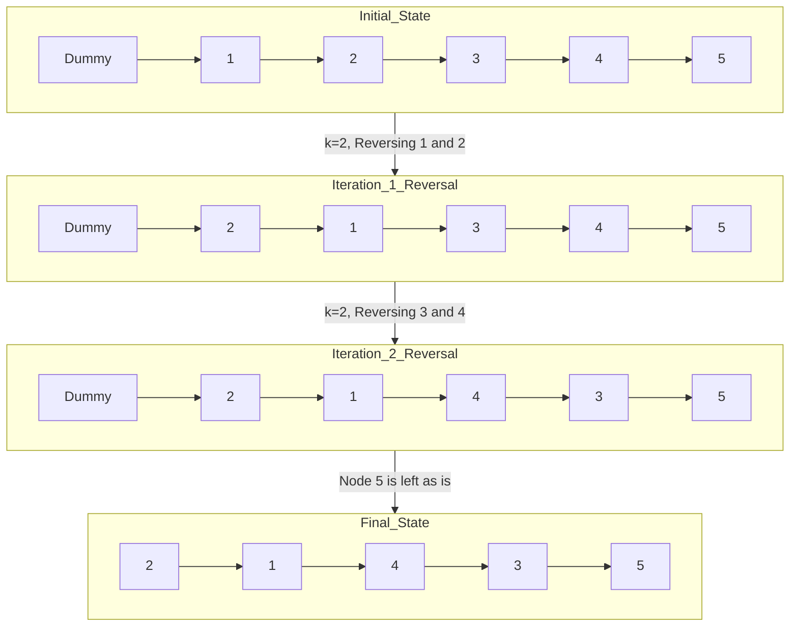

### Problem: Reverse Linked List in Groups of K (Optimal Iterative)

---

### Short Revision Notes (Exam Quick Recall)

- Pattern: Linked list manipulation with iteration
- Core Idea: Reverse exactly k nodes at a time iteratively
- Key Trick: Check k nodes exist before reversing using a loop
- Complexity: O(n) time, O(1) auxiliary space

---

### Code Snippet (Important Part Only)

```cpp
#include <initializer_list>
#include <iostream>
using namespace std;

struct Node
{
    int data;
    Node *next;
    Node(int val) : data(val), next(nullptr) {}
};

Node *reverseKGroup(Node *head, int k)
{
    if (!head || k <= 1)
        return head;

    Node *dummy = new Node(0);
    dummy->next = head;

    Node *groupPrev = dummy;

    while (true)
    {
        Node *kth = groupPrev;

        for (int i = 0; i < k && kth != nullptr; i++)
        {
            kth = kth->next;
        }

        if (kth == nullptr)
            break;

        Node *groupNext = kth->next;

        Node *prev = groupNext;
        Node *curr = groupPrev->next;

        while (curr != groupNext)
        {
            Node *temp = curr->next;
            curr->next = prev;
            prev = curr;
            curr = temp;
        }

        Node *temp = groupPrev->next;
        groupPrev->next = kth;
        groupPrev = temp;
    }

    Node *res = dummy->next;
    delete dummy;
    return res;
}
```

---

### Detailed Line-by-Line Explanation

#### Struct Definition
```cpp
struct Node {
    int data;
    Node *next;
    Node(int val) : data(val), next(nullptr) {}
};
```
*   Defines a Node structure for our linked list, holding `data` and a `next` pointer, initialized to `nullptr` in the constructor.

#### Function: `reverseKGroup`
```cpp
Node *reverseKGroup(Node *head, int k) {
```
*   The main function which takes the `head` of the linked list and an integer `k` specifying the group size to reverse.

```cpp
    if (!head || k <= 1)
        return head;
```
*   Base case check. If the list is empty (`head == nullptr`) or `k` is 1 or less, there is no need to reverse. Return the `head` as is.

```cpp
    Node *dummy = new Node(0);
    dummy->next = head;
```
*   Creates a `dummy` node and links it to the original `head`. This simplifies operations at the start of the list since the head node might be replaced.

```cpp
    Node *groupPrev = dummy;
```
*   Initializes `groupPrev` to the `dummy` node. This pointer always points to the node just before the current group of size `k` we are reversing.

```cpp
    while (true) {
```
*   Starts an infinite loop to process all groups of size `k` in the list.

```cpp
        Node *kth = groupPrev;
        for (int i = 0; i < k && kth != nullptr; i++) {
            kth = kth->next;
        }
```
*   Finds the k-th node. Iterates `k` times starting from `groupPrev` to move `kth` to the end of the group.

```cpp
        if (kth == nullptr)
            break;
```
*   If `kth` becomes `nullptr` before `k` steps are taken, less than `k` nodes are remaining. The loop breaks, leaving the rest un-reversed.

```cpp
        Node *groupNext = kth->next;
```
*   Captures the node immediately after the k-th node (`groupNext`), which marks the boundary of the current group.

```cpp
        Node *prev = groupNext;
        Node *curr = groupPrev->next;
```
*   Prepares for reversal. `curr` starts at the first node of the group. `prev` is initialized to `groupNext`. This is a trick so the reversed group automatically points to the next part of the list!

```cpp
        while (curr != groupNext) {
            Node *temp = curr->next;
            curr->next = prev;
            prev = curr;
            curr = temp;
        }
```
*   Reverses the nodes within the group by flipping the `next` pointers.

```cpp
        Node *temp = groupPrev->next;
        groupPrev->next = kth;
        groupPrev = temp;
    }
```
*   `temp` stores the old first node of the group (now the last node after reversal).
*   Connects the node before the group (`groupPrev`) to the new first node of the group (`kth`).
*   Moves `groupPrev` forward to `temp`, setting it up perfectly for the next iteration.

```cpp
    Node *res = dummy->next;
    delete dummy;
    return res;
}
```
*   Gets the new head from `dummy->next`, frees the `dummy` memory, and returns the result.

---

### Dry Run

Let's dry run with: `1 -> 2 -> 3 -> 4 -> 5` and `k = 2`.

**Initialization:**
*   `dummy` -> `1`
*   `groupPrev` = `dummy`

**Iteration 1:**
*   `kth` = `groupPrev`. Move 2 steps: `kth` becomes `2`.
*   `kth` is not null.
*   `groupNext` = `3`.
*   `prev` = `3`.
*   `curr` = `1`.
*   Reverse loop:
    *   `curr=1`: `temp`=2, `1->next`=3, `prev`=1, `curr`=2
    *   `curr=2`: `temp`=3, `2->next`=1, `prev`=2, `curr`=3
*   `temp` = `groupPrev->next` (which is `1`).
*   `groupPrev->next` (`dummy->next`) = `2`. List: `dummy -> 2 -> 1 -> 3 -> 4 -> 5`
*   `groupPrev` = `1`.

**Iteration 2:**
*   `kth` = `groupPrev` (`1`). Move 2 steps: `kth` becomes `4`.
*   `kth` is not null.
*   `groupNext` = `5`.
*   `prev` = `5`.
*   `curr` = `3`.
*   Reverse loop:
    *   `curr=3`: `temp`=4, `3->next`=5, `prev`=3, `curr`=4
    *   `curr=4`: `temp`=5, `4->next`=3, `prev`=4, `curr`=5
*   `temp` = `groupPrev->next` (which is `3`).
*   `groupPrev->next` (`1->next`) = `4`. List: `dummy -> 2 -> 1 -> 4 -> 3 -> 5`
*   `groupPrev` = `3`.

**Iteration 3:**
*   `kth` = `groupPrev` (`3`). Move 2 steps: `kth` becomes `nullptr`.
*   Loop breaks.

**Result:**
*   Return `dummy->next`, which is `2`. Final List: `2 -> 1 -> 4 -> 3 -> 5`.

---

### Visualization (USE MERMAID ONLY, NO ASCII)


