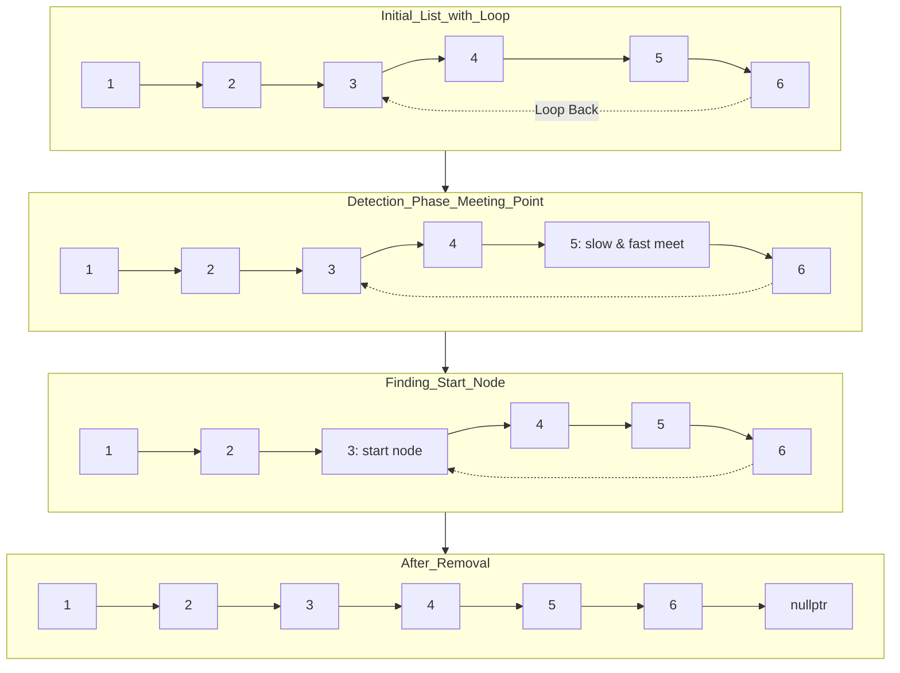

### Problem: Detect and Remove Loop in Linked List

---

### Short Revision Notes (Exam Quick Recall)

- Pattern: Floyd's Cycle Detection (Tortoise & Hare)
- Core Idea: slow=1 step, fast=2 steps; if they meet → loop exists
- Key Trick: After meeting, reset slow to head; advance both by 1 step until they meet again → loop start
- Complexity: O(n) time, O(1) space

---

### Code Snippet (Important Part Only)

```cpp
#include <iostream>
using namespace std;

struct Node {
    int data;
    Node* next;
    Node(int val) : data(val), next(nullptr) {}
};

bool detectAndRemoveLoop(Node *head)
{
    if (!head || !head->next)
        return false;

    Node *slow = head;
    Node *fast = head;

    // Detect loop
    while (fast && fast->next)
    {
        slow = slow->next;
        fast = fast->next->next;
        if (slow == fast)
            break;
    }

    if (!fast || !fast->next)
        return false;

    // Find loop start
    slow = head;
    while (slow != fast)
    {
        slow = slow->next;
        fast = fast->next;
    }

    // Find last node of loop
    Node *ptr = slow;
    while (ptr->next != slow)
    {
        ptr = ptr->next;
    }

    // Remove loop
    ptr->next = nullptr;

    return true;
}
```

---

### Detailed Line-by-Line Explanation

#### Struct Definition
```cpp
struct Node {
    int data;
    Node* next;
    Node(int val) : data(val), next(nullptr) {}
};
```
*   Defines a structure representing a node in the linked list.

#### Function: `detectAndRemoveLoop`
```cpp
bool detectAndRemoveLoop(Node *head) {
```
*   Function taking the head of the linked list. Returns `true` if a loop was detected and removed.

```cpp
    if (!head || !head->next)
        return false;
```
*   Base case: if the list is empty or has only one node, no loop can possibly exist, so we return `false`.

```cpp
    Node *slow = head;
    Node *fast = head;
```
*   Initializes a `slow` pointer (tortoise) and a `fast` pointer (hare) to the head of the list.

```cpp
    while (fast && fast->next) {
```
*   Loops to detect cycle. Requires `fast` and `fast->next` to be valid so we can safely jump two steps.

```cpp
        slow = slow->next;
        fast = fast->next->next;
```
*   Moves the `slow` pointer by one step and the `fast` pointer by two steps.

```cpp
        if (slow == fast)
            break;
    }
```
*   If `slow` and `fast` pointers meet, a loop is detected. We break out of the cycle detection loop.

```cpp
    if (!fast || !fast->next)
        return false;
```
*   Checks if `fast` reached the end of the list after the loop breaks. If it did, there is no loop. Return `false`.

```cpp
    slow = head;
```
*   Resets the `slow` pointer back to the `head` of the list. Keeps `fast` where they met. (Floyd's algorithm to find loop start).

```cpp
    while (slow != fast) {
        slow = slow->next;
        fast = fast->next;
    }
```
*   Moves both pointers one step at a time. The point where they meet again is mathematically proven to be the start of the loop.

```cpp
    Node *ptr = slow;
```
*   Now both `slow` and `fast` point to the start of the loop. We initialize `ptr` here to find the node right *before* the start of the loop (the last node).

```cpp
    while (ptr->next != slow) {
        ptr = ptr->next;
    }
```
*   Traverses the loop to find the last node. Stops when `ptr->next` points back to the loop start (`slow`).

```cpp
    ptr->next = nullptr;
    return true;
}
```
*   Breaks the cycle by setting the `next` pointer of the last node to `nullptr`, and returns `true`.

---

### Dry Run

List: `1 -> 2 -> 3 -> 4 -> 5 -> 6` where `6` points back to `3`. Loop is `3-4-5-6-3...`

**Phase 1: Detect Loop**
*   `slow=1`, `fast=1`
*   Step 1: `slow=2`, `fast=3`
*   Step 2: `slow=3`, `fast=5`
*   Step 3: `slow=4`, `fast=3` (since 5->6, 6->3)
*   Step 4: `slow=5`, `fast=5` (since 3->4, 4->5)
*   They meet at `5`. Loop detected!

**Phase 2: Find Loop Start**
*   Reset `slow` to `head` (1). `fast` stays at `5`.
*   Step 1: `slow=2`, `fast=6` (from 5->6)
*   Step 2: `slow=3`, `fast=3` (from 6->3)
*   They meet at `3`. Start of the loop is `3`.

**Phase 3: Remove Loop**
*   `ptr` starts at `3`.
*   Step 1: `ptr->next` is `4`. `ptr` moves to `4`.
*   Step 2: `ptr->next` is `5`. `ptr` moves to `5`.
*   Step 3: `ptr->next` is `6`. `ptr` moves to `6`.
*   Step 4: `ptr->next` is `3` (which is `slow`). Break.
*   Set `ptr->next` to `nullptr` (so `6->next = nullptr`).
*   List becomes `1 -> 2 -> 3 -> 4 -> 5 -> 6 -> NULL`.

---

### Visualization (USE MERMAID ONLY, NO ASCII)


