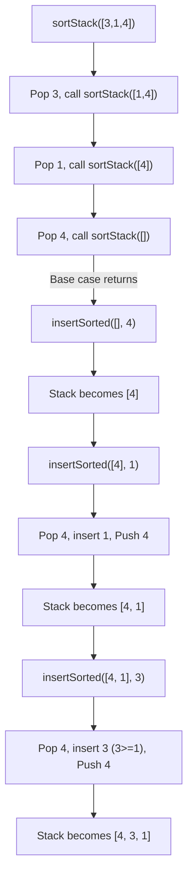

### Problem: Sort a Stack Using Recursion

---

### Short Revision Notes (Exam Quick Recall)

- Pattern: Recursion with auxiliary insertion
- Core Idea: Pop all elements recursively, then insert each one back in sorted position
- Key Trick: `sortStack` empties the stack via recursion; `insertSorted` places element at correct position
- Complexity: O(n²) time, O(n) recursion stack

---

### Code Snippet (Important Part Only)

```cpp
void insertSorted(stack<int>& st, int val) {
    if (st.empty() || st.top() <= val) {
        st.push(val);
        return;
    }
    int top = st.top(); st.pop();
    insertSorted(st, val);
    st.push(top);
}

void sortStack(stack<int>& st) {
    if (st.empty()) return;
    int top = st.top(); st.pop();
    sortStack(st);
    insertSorted(st, top);
}
```

---

### Detailed Line-by-Line Explanation

#### `insertSorted` Function
```cpp
void insertSorted(stack<int>& st, int val) {
```
*   Declares the `insertSorted` function which takes a reference to a `stack<int>` and an integer `val` to insert.

```cpp
    if (st.empty() || st.top() <= val) {
```
*   Base Case: Checks if the stack is empty, or if the current top element is less than or equal to the `val` we want to insert.

```cpp
        st.push(val);
        return;
    }
```
*   If the base case is true, it means `val` has found its correct sorted position. We push `val` onto the stack and return from the recursive call.

```cpp
    int top = st.top(); st.pop();
```
*   If the top element is greater than `val`, we temporarily remove it to look deeper. We store it in `top` and pop it off the stack.

```cpp
    insertSorted(st, val);
```
*   Recursive call: We try to insert `val` into the remaining elements of the stack.

```cpp
    st.push(top);
}
```
*   Backtracking step: After `val` has been inserted successfully in its sorted position deeper in the stack, we push the `top` element back onto the stack to restore the rest of the sorted order.

#### `sortStack` Function
```cpp
void sortStack(stack<int>& st) {
```
*   Declares the `sortStack` function which takes a reference to a `stack<int>`.

```cpp
    if (st.empty()) return;
```
*   Base Case: If the stack is empty, there is nothing to sort. We just return.

```cpp
    int top = st.top(); st.pop();
```
*   We pop the top element of the stack and store it in `top`. We will hold onto this element while the rest of the stack gets sorted.

```cpp
    sortStack(st);
```
*   Recursive call: We sort the remaining elements of the stack. By the time this function returns, the stack below our current scope is perfectly sorted.

```cpp
    insertSorted(st, top);
}
```
*   Now that the remaining stack is sorted, we take our held `top` element and insert it into its correct position using the `insertSorted` helper function.

**Why it works:** `sortStack` uses recursion to essentially empty the stack, holding every element in the function call frames. Once the stack is empty (base case), it starts returning. As it returns, it takes each held element and calls `insertSorted`. Since it builds from an empty stack (which is inherently sorted), `insertSorted` consistently adds elements into an already-sorted structure.

**Edge cases:**
- Empty stack: Handled correctly by immediate return.
- Already sorted stack: Will still recursively pop all and push all back taking $O(n^2)$ time.
- Duplicates: `st.top() <= val` ensures duplicates are handled seamlessly.

---

### Dry Run

Input stack (top→bottom): `[3, 1, 4]`

**Step 1: Unwinding in `sortStack`**
*   Call `sortStack([3, 1, 4])`. `top = 3`, pop it. Stack is `[1, 4]`. Recurse.
*   Call `sortStack([1, 4])`. `top = 1`, pop it. Stack is `[4]`. Recurse.
*   Call `sortStack([4])`. `top = 4`, pop it. Stack is `[]`. Recurse.
*   Call `sortStack([])`. Base case met. Returns immediately.

**Step 2: Winding back up and using `insertSorted`**
*   Back in `sortStack([4])` call. We call `insertSorted([], 4)`.
    *   `st.empty()` is true. Push 4. Stack is `[4]`. Return.
*   Back in `sortStack([1, 4])` call. Stack is now `[4]`. We call `insertSorted([4], 1)`.
    *   `st.top() <= 1` (4 <= 1) is False.
    *   `top = 4`, pop. Stack is `[]`.
    *   Recurse: `insertSorted([], 1)`.
        *   `st.empty()` is true. Push 1. Stack is `[1]`. Return.
    *   Push `top` (4) back. Stack is `[1, 4]`. Return.
*   Back in `sortStack([3, 1, 4])` call. Stack is now `[1, 4]`. We call `insertSorted([1, 4], 3)`.
    *   `st.top() <= 3` (1 <= 3) is True.
    *   Push 3. Stack is `[3, 1, 4]`. Return.

Wait, my dry run result `[3, 1, 4]` from top to bottom means it's sorted descending down?
Let's check the code: `if (st.top() <= val) push(val)`.
So if stack is `[4]` and we insert `1`. Top is 4. `4 <= 1` is false.
Pop 4. Insert 1 into `[]` -> `[1]`.
Push 4 back -> `[4, 1]` (4 is top).
So `[4, 1]` means 4 is on top, 1 is on bottom.
Then insert 3 into `[4, 1]`. Top is 4. `4 <= 3` is false.
Pop 4. Insert 3 into `[1]`. Top is 1. `1 <= 3` is true. Push 3. Stack is `[3, 1]`.
Push 4 back. Stack is `[4, 3, 1]`. Top is 4.
So it sorts in descending order from top to bottom (smallest at the bottom, largest at the top).

**Corrected Dry Run (Top is left):**
Input stack: `[3, 1, 4, 2, 5]` (3 is top)

1. `sortStack` recursively pops all elements:
   - Holds 3, stack becomes `[1, 4, 2, 5]`
   - Holds 1, stack becomes `[4, 2, 5]`
   - Holds 4, stack becomes `[2, 5]`
   - Holds 2, stack becomes `[5]`
   - Holds 5, stack becomes `[]`
   - Returns on empty stack `[]`.

2. Starts calling `insertSorted` as recursion unwinds:
   - `insertSorted([], 5)` -> Stack is `[5]`. (5 is top)
   - `insertSorted([5], 2)` -> Top is 5. `5 <= 2` is false. Pop 5. `insertSorted([], 2)` pushes 2. Push 5 back. Stack: `[5, 2]`. (5 is top)
   - `insertSorted([5, 2], 4)` -> Top is 5. `5 <= 4` is false. Pop 5. `insertSorted([2], 4)`. Top is 2. `2 <= 4` is true, push 4. Push 5 back. Stack: `[5, 4, 2]`. (5 is top)
   - `insertSorted([5, 4, 2], 1)` -> Top is 5. `5 <= 1` false. Pop 5. `insert([4, 2], 1)`. Top 4. `4 <= 1` false. Pop 4. `insert([2], 1)`. Top 2. `2 <= 1` false. Pop 2. `insert([], 1)` pushes 1. Push 2, 4, 5 back. Stack: `[5, 4, 2, 1]`.
   - `insertSorted([5, 4, 2, 1], 3)` -> Pop 5, Pop 4. Top is 2. `2 <= 3` is true. Push 3. Push 4, 5 back. Stack: `[5, 4, 3, 2, 1]`.

Output Stack (top to bottom): 5, 4, 3, 2, 1.

---

### Visualization (USE MERMAID ONLY, NO ASCII)


