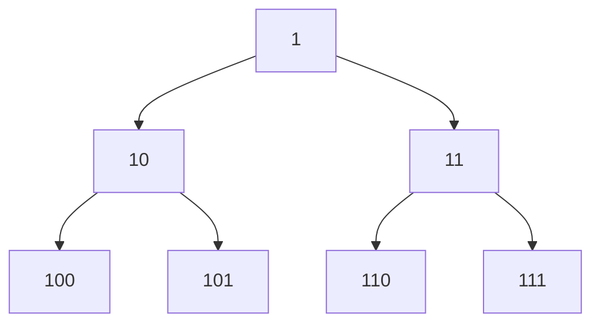

### Problem: Generate Binary Numbers from 1 to N Using Queue

---

### Short Revision Notes (Exam Quick Recall)

- Pattern: BFS-style level generation
- Core Idea: Start with "1"; for each dequeued string, enqueue string+"0" and string+"1"
- Key Trick: Queue ensures BFS order which naturally gives binary in ascending order
- Complexity: O(n) time and space

---

### Code Snippet (Important Part Only)

```cpp
#include <iostream>
#include <queue>
#include <string>
using namespace std;

void generateBinary(int n) {
    queue<string> q;
    q.push("1");
    for (int i = 0; i < n; i++) {
        string curr = q.front(); q.pop();
        cout << curr << "\n";
        q.push(curr + "0");
        q.push(curr + "1");
    }
}
```

---

### Detailed Line-by-Line Explanation

```cpp
void generateBinary(int n) {
```
*   Declares the function `generateBinary` that takes an integer `n`, representing how many binary numbers to generate.

```cpp
    queue<string> q;
```
*   Creates an empty queue named `q` that stores standard library `string` objects. Using strings avoids integer overflow for large binary numbers.

```cpp
    q.push("1");
```
*   Pushes the first binary number, `"1"`, into the queue. This is the starting point for all subsequent binary numbers.

```cpp
    for (int i = 0; i < n; i++) {
```
*   Starts a loop that will run exactly `n` times to generate and print `n` binary numbers.

```cpp
        string curr = q.front(); q.pop();
```
*   Retrieves the string at the front of the queue and stores it in `curr`. Immediately after, it pops (removes) this element from the queue. 

```cpp
        cout << curr << "\n";
```
*   Prints the current binary string to the console.

```cpp
        q.push(curr + "0");
```
*   Appends `"0"` to the current binary string and pushes the resulting new string to the back of the queue.

```cpp
        q.push(curr + "1");
```
*   Appends `"1"` to the current binary string and pushes the resulting new string to the back of the queue.

```cpp
    }
}
```
*   Closes the loop and the function.

**Why it works:** Binary numbers in ascending order correspond exactly to BFS traversal of a complete binary tree where the left child appends "0" and the right child appends "1".

**Edge cases:**
- n=0: The loop won't run, nothing is printed.
- n=1: Prints "1" and stops.

**Common mistakes:**
- Using DFS (stack) instead of BFS (queue) — gives wrong order
- Integer overflow for large n — use strings, not ints

---

### Dry Run

`n=5`:

**Initialization:** 
*   Queue: `["1"]`

**Iteration 1 (`i=0`):**
*   `curr = q.front()` -> `"1"`.
*   `q.pop()` -> Queue: `[]`.
*   Print: `1`
*   `q.push("1" + "0")` -> Queue: `["10"]`
*   `q.push("1" + "1")` -> Queue: `["10", "11"]`

**Iteration 2 (`i=1`):**
*   `curr = q.front()` -> `"10"`.
*   `q.pop()` -> Queue: `["11"]`.
*   Print: `10`
*   `q.push("10" + "0")` -> Queue: `["11", "100"]`
*   `q.push("10" + "1")` -> Queue: `["11", "100", "101"]`

**Iteration 3 (`i=2`):**
*   `curr = q.front()` -> `"11"`.
*   `q.pop()` -> Queue: `["100", "101"]`.
*   Print: `11`
*   `q.push("11" + "0")` -> Queue: `["100", "101", "110"]`
*   `q.push("11" + "1")` -> Queue: `["100", "101", "110", "111"]`

**Iteration 4 (`i=3`):**
*   `curr = q.front()` -> `"100"`.
*   `q.pop()` -> Queue: `["101", "110", "111"]`.
*   Print: `100`
*   Push `"1000"`, `"1001"`. Queue: `["101", "110", "111", "1000", "1001"]`

**Iteration 5 (`i=4`):**
*   `curr = q.front()` -> `"101"`.
*   `q.pop()` -> Queue: `["110", "111", "1000", "1001"]`.
*   Print: `101`
*   Push `"1010"`, `"1011"`. Queue: `["110", "111", "1000", "1001", "1010", "1011"]`

Output: 1, 10, 11, 100, 101

---

### Visualization (USE MERMAID ONLY, NO ASCII)


