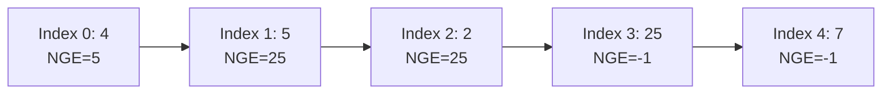

### Problem: Next Greater Element Using Stack

---

### Short Revision Notes (Exam Quick Recall)

- Pattern: Monotonic Stack (decreasing)
- Core Idea: Maintain a stack of indices; when current element > stack top's element, that's the NGE for the top
- Key Trick: Process left-to-right; elements without NGE remain in stack → result stays -1
- Complexity: O(n) time, O(n) space

---

### Code Snippet (Important Part Only)

```cpp
#include <iostream>
#include <vector>
#include <stack>
using namespace std;

vector<int> nextGreaterElement(const vector<int>& arr) {
    int n = arr.size();
    vector<int> result(n, -1);
    stack<int> st; // stores indices

    for (int i = 0; i < n; i++) {
        while (!st.empty() && arr[st.top()] < arr[i]) {
            result[st.top()] = arr[i];
            st.pop();
        }
        st.push(i);
    }
    return result;
}
```

---

### Detailed Line-by-Line Explanation

```cpp
vector<int> nextGreaterElement(const vector<int>& arr) {
```
*   Declares the function `nextGreaterElement` that takes a constant reference to a vector of integers `arr` and returns a vector of integers containing the next greater elements.

```cpp
    int n = arr.size();
```
*   Stores the size of the input array in a variable `n`.

```cpp
    vector<int> result(n, -1);
```
*   Initializes the `result` vector with the same size `n` as the input array, and fills it entirely with `-1`. This handles elements that don't have a next greater element.

```cpp
    stack<int> st; // stores indices
```
*   Declares a stack `st` of integers. Crucially, this stack will store the **indices** of elements, not their actual values. This makes it easier to place the result at the correct position.

```cpp
    for (int i = 0; i < n; i++) {
```
*   Starts a loop iterating through each index `i` of the input array from left to right.

```cpp
        while (!st.empty() && arr[st.top()] < arr[i]) {
```
*   The `while` loop runs as long as the stack is not empty AND the element in the array at the index currently at the top of the stack (`arr[st.top()]`) is strictly less than the current array element we are evaluating (`arr[i]`). 

```cpp
            result[st.top()] = arr[i];
```
*   If the condition is true, it means we have found the Next Greater Element for the element whose index is at the top of the stack! So, we update the `result` array at that index to be the current element `arr[i]`.

```cpp
            st.pop();
        }
```
*   After finding its NGE, we no longer need to keep track of this index. We pop it from the stack. The `while` loop will then check the *new* top of the stack against `arr[i]`.

```cpp
        st.push(i);
    }
```
*   After resolving all possible NGEs using the current element `arr[i]`, we push the current index `i` onto the stack because we have not yet found the next greater element for `arr[i]`. It sits in the stack waiting for a future larger element to arrive.

```cpp
    return result;
}
```
*   Returns the fully populated `result` array. Any elements remaining in the stack simply keep the `-1` initialized earlier.

---

### Dry Run

Array: `[4, 5, 2, 25, 7]`

**Initialization:**
*   `result`: `[-1, -1, -1, -1, -1]`
*   `st`: `[]`

**Iteration 1 (`i = 0`, `arr[0] = 4`):**
*   Stack is empty. `while` loop is skipped.
*   Push index `0`. Stack: `[0]`.

**Iteration 2 (`i = 1`, `arr[1] = 5`):**
*   Stack is not empty. Top is `0`.
*   Check `arr[0] < arr[1]` -> `4 < 5`. True!
    *   `result[0] = arr[1]` -> `result[0] = 5`. `result`: `[5, -1, -1, -1, -1]`
    *   Pop from stack. Stack: `[]`.
*   Push index `1`. Stack: `[1]`.

**Iteration 3 (`i = 2`, `arr[2] = 2`):**
*   Stack is not empty. Top is `1`.
*   Check `arr[1] < arr[2]` -> `5 < 2`. False.
*   Push index `2`. Stack: `[1, 2]`. (Notice stack values `arr[1]=5, arr[2]=2` are decreasing: monotonic stack!)

**Iteration 4 (`i = 3`, `arr[3] = 25`):**
*   Stack is not empty. Top is `2`.
*   Check `arr[2] < arr[3]` -> `2 < 25`. True!
    *   `result[2] = 25`. `result`: `[5, -1, 25, -1, -1]`
    *   Pop from stack. Stack: `[1]`.
*   Stack is not empty. Top is `1`.
*   Check `arr[1] < arr[3]` -> `5 < 25`. True!
    *   `result[1] = 25`. `result`: `[5, 25, 25, -1, -1]`
    *   Pop from stack. Stack: `[]`.
*   Push index `3`. Stack: `[3]`.

**Iteration 5 (`i = 4`, `arr[4] = 7`):**
*   Stack is not empty. Top is `3`.
*   Check `arr[3] < arr[4]` -> `25 < 7`. False.
*   Push index `4`. Stack: `[3, 4]`.

**End of loop.**
Indices left in stack: `3` (value 25) and `4` (value 7). They have no next greater element, so they remain `-1` in `result`.

Final Result: `[5, 25, 25, -1, -1]`

---

### Visualization (USE MERMAID ONLY, NO ASCII)


