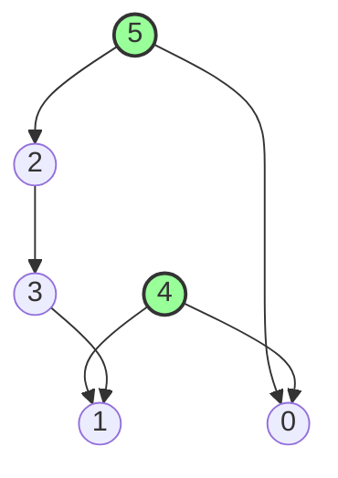

### Problem: Topological Sort Using BFS (Kahn's Algorithm)

---

### Short Revision Notes (Exam Quick Recall)

- Pattern: BFS on DAG using in-degree
- Core Idea: Nodes with in-degree 0 have no dependencies; process them first, reducing neighbors' in-degree
- Key Trick: If result size < V → cycle detected
- Complexity: O(V + E) time and space

---

### Code Snippet (Important Part Only)

```cpp
#include <iostream>
#include <vector>
#include <queue>
using namespace std;

vector<int> topoSort(int V, const vector<vector<int>>& adj) {
    vector<int> indegree(V, 0);
    for (int u = 0; u < V; u++)
        for (int v : adj[u]) indegree[v]++;

    queue<int> q;
    for (int i = 0; i < V; i++)
        if (indegree[i] == 0) q.push(i);

    vector<int> order;
    while (!q.empty()) {
        int u = q.front(); q.pop();
        order.push_back(u);
        for (int v : adj[u])
            if (--indegree[v] == 0) q.push(v);
    }
    return order; // size < V means cycle exists
}
```

---

### Detailed Line-by-Line Explanation

```cpp
vector<int> topoSort(int V, const vector<vector<int>>& adj) {
```
*   Declares the function `topoSort` that takes `V` (number of vertices) and `adj` (adjacency list of the directed graph) and returns a vector containing the topologically sorted order.

```cpp
    vector<int> indegree(V, 0);
```
*   Initializes a vector `indegree` of size `V` with all values set to 0. This tracks how many incoming edges point to each vertex.

```cpp
    for (int u = 0; u < V; u++)
        for (int v : adj[u]) indegree[v]++;
```
*   Iterates through every node `u` in the graph, and for every neighbor `v` that `u` points to, increments the in-degree of `v`.

```cpp
    queue<int> q;
```
*   Creates a queue `q` to process nodes. In Kahn's algorithm, the queue stores nodes that have an in-degree of 0 (meaning all their prerequisites have been met).

```cpp
    for (int i = 0; i < V; i++)
        if (indegree[i] == 0) q.push(i);
```
*   Iterates through all vertices to find any that initially have an in-degree of 0, and pushes them into the queue.

```cpp
    vector<int> order;
```
*   Declares a vector `order` to store the final topological sort result.

```cpp
    while (!q.empty()) {
```
*   Standard BFS loop: runs as long as there are nodes with 0 in-degree waiting to be processed.

```cpp
        int u = q.front(); q.pop();
```
*   Extracts the front node `u` from the queue and removes it.

```cpp
        order.push_back(u);
```
*   Since `u` has 0 in-degree, its prerequisites are satisfied. We add it to our `order` result.

```cpp
        for (int v : adj[u])
```
*   Iterates over all adjacent neighbors `v` that `u` points to.

```cpp
            if (--indegree[v] == 0) q.push(v);
```
*   Crucial step: Since node `u` has been processed, we "remove" the edge from `u` to `v` by decrementing `indegree[v]`. If decrementing makes the in-degree of `v` exactly 0, it means all prerequisites of `v` have now been met, so we push `v` into the queue to be processed later.

```cpp
    }
    return order; // size < V means cycle exists
}
```
*   Returns the resulting `order` vector. Note: If the graph contains a cycle, the nodes in the cycle will never reach an in-degree of 0, so the loop will finish early. You can detect cycles by checking if `order.size() < V`.

---

### Dry Run

Graph (DAG): `5->2`, `5->0`, `4->0`, `4->1`, `2->3`, `3->1`.
Vertices `V = 6` (0 to 5).

**Step 1: Compute In-degrees**
*   Node 0: from 4, 5 (in-degree: 2)
*   Node 1: from 4, 3 (in-degree: 2)
*   Node 2: from 5 (in-degree: 1)
*   Node 3: from 2 (in-degree: 1)
*   Node 4: none (in-degree: 0)
*   Node 5: none (in-degree: 0)
*   `indegree = [2, 2, 1, 1, 0, 0]`

**Step 2: Initialize Queue**
*   Nodes with in-degree 0: `4` and `5`.
*   Queue: `[4, 5]`

**Step 3: BFS Processing**

*   **Process 4:** `u = 4`. `order = [4]`.
    *   Neighbors of 4: `0`, `1`.
    *   `indegree[0]` becomes 1.
    *   `indegree[1]` becomes 1.
    *   Queue: `[5]`

*   **Process 5:** `u = 5`. `order = [4, 5]`.
    *   Neighbors of 5: `2`, `0`.
    *   `indegree[2]` becomes 0 -> Push 2.
    *   `indegree[0]` becomes 0 -> Push 0.
    *   Queue: `[2, 0]`

*   **Process 2:** `u = 2`. `order = [4, 5, 2]`.
    *   Neighbors of 2: `3`.
    *   `indegree[3]` becomes 0 -> Push 3.
    *   Queue: `[0, 3]`

*   **Process 0:** `u = 0`. `order = [4, 5, 2, 0]`.
    *   Neighbors of 0: None.
    *   Queue: `[3]`

*   **Process 3:** `u = 3`. `order = [4, 5, 2, 0, 3]`.
    *   Neighbors of 3: `1`.
    *   `indegree[1]` becomes 0 -> Push 1.
    *   Queue: `[1]`

*   **Process 1:** `u = 1`. `order = [4, 5, 2, 0, 3, 1]`.
    *   Neighbors of 1: None.
    *   Queue: `[]`

Queue is empty. Result is `[4, 5, 2, 0, 3, 1]`. Length is 6, which equals V, so no cycle.

---

### Visualization (USE MERMAID ONLY, NO ASCII)


