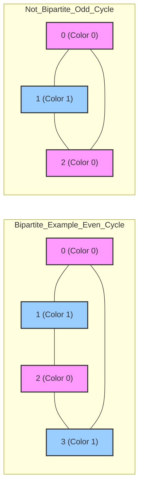

### Problem: Check if Graph is Bipartite Using BFS

---

### Short Revision Notes (Exam Quick Recall)

- Pattern: BFS 2-coloring
- Core Idea: Color a node, color all neighbors the opposite color; conflict → not bipartite
- Key Trick: A graph is bipartite iff it has no odd-length cycles
- Complexity: O(V + E) time, O(V) space

---

### Code Snippet (Important Part Only)

```cpp
#include <iostream>
#include <vector>
#include <queue>
using namespace std;

bool isBipartite(int V, vector<vector<int>>& adj) {
    vector<int> color(V, -1);

    for (int src = 0; src < V; src++) {
        if (color[src] != -1) continue;
        queue<int> q;
        q.push(src);
        color[src] = 0;

        while (!q.empty()) {
            int u = q.front(); q.pop();
            for (int v : adj[u]) {
                if (color[v] == -1) {
                    color[v] = 1 - color[u];
                    q.push(v);
                } else if (color[v] == color[u]) {
                    return false;
                }
            }
        }
    }
    return true;
}
```

---

### Detailed Line-by-Line Explanation

```cpp
bool isBipartite(int V, vector<vector<int>>& adj) {
```
*   Declares the function `isBipartite` that checks whether a graph with `V` vertices and an adjacency list `adj` can be colored using only two colors without any two adjacent vertices having the same color.

```cpp
    vector<int> color(V, -1);
```
*   Initializes a `color` array (using a vector) for all `V` vertices, setting every vertex's initial color to `-1`, representing "uncolored" or "unvisited". The two valid colors we will use are `0` and `1`.

```cpp
    for (int src = 0; src < V; src++) {
```
*   A `for` loop that iterates through every vertex from `0` to `V - 1`. This loop handles graphs that might be disconnected. If the graph has multiple disconnected components, BFS needs to be triggered for each uncolored component.

```cpp
        if (color[src] != -1) continue;
```
*   Checks if the current vertex `src` has already been colored during the BFS traversal of a previous component. If it is not `-1` (already colored), we skip it.

```cpp
        queue<int> q;
```
*   Declares a queue `q` of integers to facilitate the Breadth-First Search (BFS) traversal.

```cpp
        q.push(src);
```
*   Pushes the current unvisited vertex `src` onto the queue to start the BFS for this component.

```cpp
        color[src] = 0;
```
*   Assigns the starting vertex `src` the first color, `0`.

```cpp
        while (!q.empty()) {
```
*   The standard BFS loop that continues running until the queue is empty, meaning all reachable vertices in the current component have been processed.

```cpp
            int u = q.front(); q.pop();
```
*   Retrieves the vertex `u` from the front of the queue and removes it.

```cpp
            for (int v : adj[u]) {
```
*   Iterates through all adjacent neighbors `v` of the current vertex `u`.

```cpp
                if (color[v] == -1) {
```
*   Checks if the neighbor `v` is uncolored. If so, we need to assign it the opposite color of `u` and process it.

```cpp
                    color[v] = 1 - color[u];
```
*   Assigns the opposite color. If `color[u]` is `0`, `color[v]` becomes `1 - 0 = 1`. If `color[u]` is `1`, `color[v]` becomes `1 - 1 = 0`. This is a clean mathematical trick to flip between 0 and 1.

```cpp
                    q.push(v);
```
*   Pushes the newly colored neighbor `v` onto the queue to eventually process its neighbors.

```cpp
                } else if (color[v] == color[u]) {
```
*   If the neighbor `v` is *already colored*, we must check if its color is the *same* as the current vertex `u`. If an edge connects two vertices of the same color, the graph is NOT bipartite.

```cpp
                    return false;
                }
            }
        }
    }
```
*   If a conflict is detected, it returns `false` immediately. Otherwise, the inner loops complete.

```cpp
    return true;
}
```
*   If the entire graph is traversed successfully without any color conflicts, we can safely conclude the graph is bipartite and return `true`.

---

### Dry Run

Graph: `0-1-2-3-0` (even cycle, which is bipartite). Vertices: 4. Adjacency: `0:[1,3]`, `1:[0,2]`, `2:[1,3]`, `3:[2,0]`

**Initialization:**
*   `color = [-1, -1, -1, -1]`

**Component Loop (`src = 0`):**
*   `color[0] = -1`. Starts BFS.
*   `q.push(0)`. Queue: `[0]`
*   `color[0] = 0`. `color = [0, -1, -1, -1]`

**BFS Loop 1:**
*   `u = 0`. Queue: `[]`.
*   Neighbors of 0: `1`, `3`.
*   Neighbor `1`: uncolored. `color[1] = 1 - 0 = 1`. `q.push(1)`. Queue: `[1]`
*   Neighbor `3`: uncolored. `color[3] = 1 - 0 = 1`. `q.push(3)`. Queue: `[1, 3]`

**BFS Loop 2:**
*   `u = 1`. Queue: `[3]`.
*   Neighbors of 1: `0`, `2`.
*   Neighbor `0`: already colored `0`. `color[0]` is `0`, `color[1]` is `1`. They are different. Safe.
*   Neighbor `2`: uncolored. `color[2] = 1 - 1 = 0`. `q.push(2)`. Queue: `[3, 2]`

**BFS Loop 3:**
*   `u = 3`. Queue: `[2]`.
*   Neighbors of 3: `2`, `0`.
*   Neighbor `2`: already colored `0`. `color[2]` is `0`, `color[3]` is `1`. They are different. Safe.
*   Neighbor `0`: already colored `0`. `color[0]` is `0`, `color[3]` is `1`. They are different. Safe.

**BFS Loop 4:**
*   `u = 2`. Queue: `[]`.
*   Neighbors of 2: `1`, `3`.
*   Neighbor `1`: already colored `1`. `color[1]` is `1`, `color[2]` is `0`. Safe.
*   Neighbor `3`: already colored `1`. `color[3]` is `1`, `color[2]` is `0`. Safe.

Queue is empty. Outer loop (`src = 1, 2, 3`) sees they are already colored and `continue`s.
Returns `true`.

---

### Visualization (USE MERMAID ONLY, NO ASCII)


