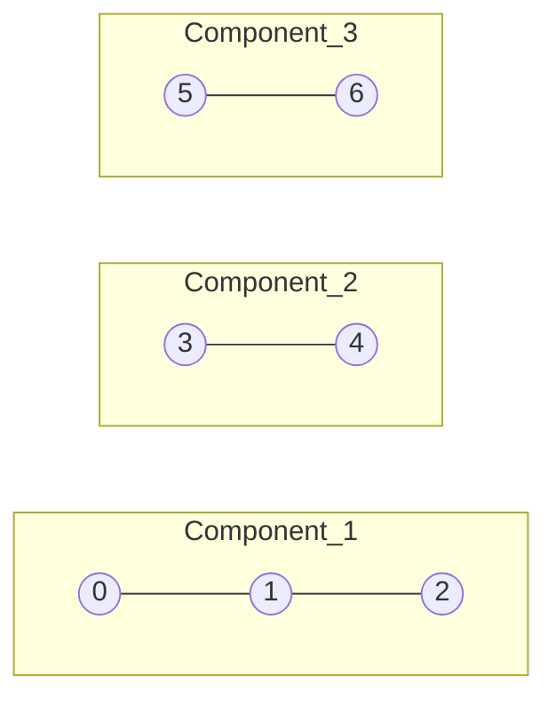

### Problem: Find Connected Components in Undirected Graph

---

### Short Revision Notes (Exam Quick Recall)

- Pattern: BFS/DFS with visited array
- Core Idea: For each unvisited node, do BFS — all reachable nodes form one component
- Key Trick: Count how many times you start a fresh BFS = number of components
- Complexity: O(V + E) time, O(V) space

---

### Code Snippet (Important Part Only)

```cpp
#include <iostream>
#include <vector>
#include <queue>
using namespace std;

int connectedComponents(int V, vector<vector<int>>& adj) {
    vector<bool> visited(V, false);
    int count = 0;

    for (int src = 0; src < V; src++) {
        if (visited[src]) continue;
        count++;
        queue<int> q;
        q.push(src);
        visited[src] = true;
        
        while (!q.empty()) {
            int u = q.front(); q.pop();
            for (int v : adj[u]) {
                if (!visited[v]) {
                    visited[v] = true;
                    q.push(v);
                }
            }
        }
    }
    return count;
}
```

---

### Detailed Line-by-Line Explanation

```cpp
int connectedComponents(int V, vector<vector<int>>& adj) {
```
*   Declares a function `connectedComponents` which calculates and returns the number of disconnected groups (components) in an undirected graph given `V` vertices and an adjacency list `adj`.

```cpp
    vector<bool> visited(V, false);
```
*   Creates a boolean array `visited` of size `V`, initially setting all values to `false`. This keeps track of whether a node has been explored by the BFS to prevent infinite loops and redundant checks.

```cpp
    int count = 0;
```
*   Initializes a `count` variable to `0`. This will store the total number of connected components. Every time we find a node that hasn't been visited yet, it must be part of a new, unseen component.

```cpp
    for (int src = 0; src < V; src++) {
```
*   A `for` loop that iterates through every possible vertex `src` from `0` to `V - 1`. This guarantees we check every node in the graph, even if the graph is broken into multiple disconnected pieces.

```cpp
        if (visited[src]) continue;
```
*   Checks if the current vertex `src` has already been visited. If it has, it belongs to a component we already counted and explored. We `continue` to skip it.

```cpp
        count++;
```
*   If we reach this line, we found a node that is `false` in the `visited` array. This signifies the discovery of a brand new connected component. We increment our `count`.

```cpp
        queue<int> q;
```
*   Initializes an empty integer queue `q` to perform Breadth-First Search (BFS) for this specific component.

```cpp
        q.push(src);
```
*   Pushes the newly discovered `src` vertex into the queue to act as the starting point of the BFS.

```cpp
        visited[src] = true;
```
*   Marks the starting vertex as `true` in the `visited` array so we don't process it again.

```cpp
        while (!q.empty()) {
```
*   The BFS loop executes as long as there are nodes in the queue, systematically exploring outwards.

```cpp
            int u = q.front(); q.pop();
```
*   Retrieves the front node `u` from the queue and removes it.

```cpp
            for (int v : adj[u]) {
```
*   Iterates through every adjacent neighbor `v` of the node `u`.

```cpp
                if (!visited[v]) {
```
*   Checks if the neighbor `v` has NOT been visited yet.

```cpp
                    visited[v] = true;
```
*   If it hasn't, it marks it as visited. Crucially, we mark it visited *when pushing* to prevent pushing the same node multiple times from different neighbors.

```cpp
                    q.push(v);
                }
            }
        }
    }
```
*   Pushes the unvisited neighbor `v` into the queue so its neighbors will be explored in future BFS iterations. Closes all loops.

```cpp
    return count;
}
```
*   After checking all `V` nodes, returns the total `count` of connected components found.

---

### Dry Run

Graph: `7` nodes (0 to 6). Edges: `0-1`, `1-2`, `3-4`, `5-6`.
Adjacency: `0:[1]`, `1:[0,2]`, `2:[1]`, `3:[4]`, `4:[3]`, `5:[6]`, `6:[5]`

**Initialization:**
*   `visited = [F, F, F, F, F, F, F]`
*   `count = 0`

**Iteration `src = 0`:**
*   `visited[0]` is False.
*   `count` becomes `1`.
*   BFS starts with Queue: `[0]`. `visited = [T, F, F, F, F, F, F]`
*   Pop 0. Neighbors: `1`. `visited[1]` is False. Mark `visited[1]=T`, Push 1. Queue: `[1]`.
*   Pop 1. Neighbors: `0`, `2`.
    *   `visited[0]` is True.
    *   `visited[2]` is False. Mark `visited[2]=T`, Push 2. Queue: `[2]`.
*   Pop 2. Neighbors: `1`. `visited[1]` is True.
*   Queue is empty. BFS ends.
*   `visited` is now `[T, T, T, F, F, F, F]`.

**Iterations `src = 1`, `src = 2`:**
*   `visited[1]` is True -> skip.
*   `visited[2]` is True -> skip.

**Iteration `src = 3`:**
*   `visited[3]` is False.
*   `count` becomes `2`.
*   BFS starts with Queue: `[3]`. `visited[3]=T`.
*   Pop 3. Neighbors: `4`. `visited[4]` is False. Mark `visited[4]=T`, Push 4. Queue: `[4]`.
*   Pop 4. Neighbors: `3`. `visited[3]` is True.
*   Queue is empty. BFS ends.
*   `visited` is now `[T, T, T, T, T, F, F]`.

**Iteration `src = 4`:**
*   `visited[4]` is True -> skip.

**Iteration `src = 5`:**
*   `visited[5]` is False.
*   `count` becomes `3`.
*   BFS starts with Queue: `[5]`. `visited[5]=T`.
*   Pop 5. Neighbors: `6`. `visited[6]` is False. Mark `visited[6]=T`, Push 6. Queue: `[6]`.
*   Pop 6. Neighbors: `5`. `visited[5]` is True.
*   Queue is empty. BFS ends.
*   `visited` is now `[T, T, T, T, T, T, T]`.

**Iteration `src = 6`:**
*   `visited[6]` is True -> skip.

**Result:**
*   Return `count`, which is `3`.

---

### Visualization (USE MERMAID ONLY, NO ASCII)


