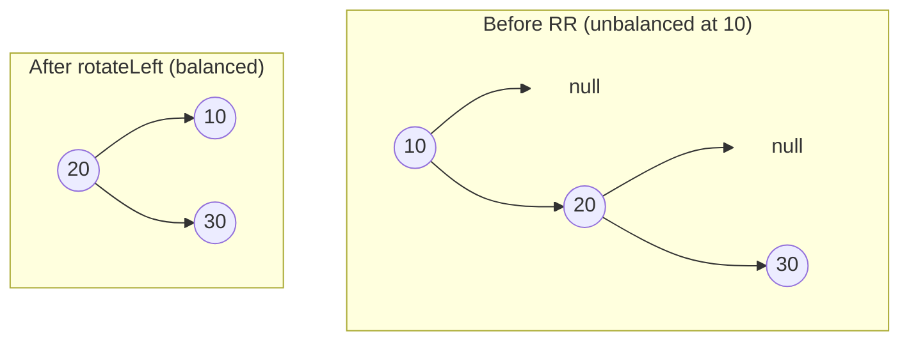

### Problem: AVL Tree (Self-Balancing BST)

---

### Short Revision Notes (Exam Quick Recall)

- **Pattern**: BST with balance factor maintenance.
- **Core Idea**: After every insert, check balance factor (BF = left_height - right_height); if |BF| > 1, rotate.
- **Key Trick**: 4 cases — LL, RR, LR (left then right rotate), RL (right then left rotate).
- **Complexity**: O(log n) insert/search time, O(n) space.

---

### Code Snippet (Important Part Only)

```cpp
Node* insert(Node* root, int key) {
    if (!root) return new Node(key);

    if (key < root->key)      root->left  = insert(root->left, key);
    else if (key > root->key) root->right = insert(root->right, key);
    else return root;

    updateHeight(root);
    int b = bf(root);

    if (b > 1 && key < root->left->key) return rotateRight(root);       // LL
    if (b < -1 && key > root->right->key) return rotateLeft(root);      // RR
    if (b > 1 && key > root->left->key) {                               // LR
        root->left = rotateLeft(root->left);
        return rotateRight(root);
    }
    if (b < -1 && key < root->right->key) {                             // RL
        root->right = rotateRight(root->right);
        return rotateLeft(root);
    }
    return root;
}
```

---

### Detailed Explanation

```cpp
    if (!root) return new Node(key);
```
- If the current `root` is null, it means we have reached a leaf node's empty child or the tree is empty. We dynamically allocate a new node and return it.

```cpp
    if (key < root->key)      root->left  = insert(root->left, key);
    else if (key > root->key) root->right = insert(root->right, key);
    else return root;
```
- Standard BST insertion logic: recurse left if the `key` is smaller, or right if it is larger. Duplicate keys are ignored by returning the unchanged `root`.

```cpp
    updateHeight(root);
    int b = bf(root);
```
- During the unwinding phase of recursion, update the height of the current `root` node based on its children's heights.
- Calculate the balance factor `b` (Height of Left Subtree - Height of Right Subtree) to check if the node has become unbalanced.

```cpp
    if (b > 1 && key < root->left->key) return rotateRight(root);       // LL
```
- **Left-Left (LL) Case**: If `b > 1`, the left subtree is heavier. If the `key` is less than the left child's key, the insertion happened in the left child's left subtree. This requires a single **Right Rotation** around the current node.

```cpp
    if (b < -1 && key > root->right->key) return rotateLeft(root);      // RR
```
- **Right-Right (RR) Case**: If `b < -1`, the right subtree is heavier. If the `key` is greater than the right child's key, the insertion happened in the right child's right subtree. This requires a single **Left Rotation** around the current node.

```cpp
    if (b > 1 && key > root->left->key) {                               // LR
        root->left = rotateLeft(root->left);
        return rotateRight(root);
    }
```
- **Left-Right (LR) Case**: If `b > 1` (left heavier) and `key > root->left->key`, the new node is in the left child's right subtree. We first perform a **Left Rotation** on the left child, which turns it into an LL case, and then perform a **Right Rotation** on the root.

```cpp
    if (b < -1 && key < root->right->key) {                             // RL
        root->right = rotateRight(root->right);
        return rotateLeft(root);
    }
```
- **Right-Left (RL) Case**: If `b < -1` (right heavier) and `key < root->right->key`, the new node is in the right child's left subtree. We first perform a **Right Rotation** on the right child, which turns it into an RR case, and then perform a **Left Rotation** on the root.

```cpp
    return root;
```
- Return the (possibly new) root pointer of the balanced subtree back up the recursive call stack.

---

### Dry Run

Insert sequence: `10, 20, 30` → RR case at `10` (balance factor = -2)

1. **Insert 10**: `root = 10` (height = 1).
2. **Insert 20**: `root = 10` (height = 2), `right = 20`.
3. **Insert 30**: 
   - `30` is inserted as the right child of `20`.
   - As recursion unwinds, `bf(20)` is checked. It is -1, so it is balanced.
   - At `root = 10`, `bf(10) = 0 - 2 = -2`. Since `30 > 10->right->key` (30 > 20), this is an RR case.
   - `rotateLeft(10)` is triggered: `20` becomes the new root, `10` becomes its left child. `20` is returned.
   - Resulting tree: `20` (root) → left: `10`, right: `30`.

---

### Visualization (USE MERMAID ONLY, NO ASCII)


