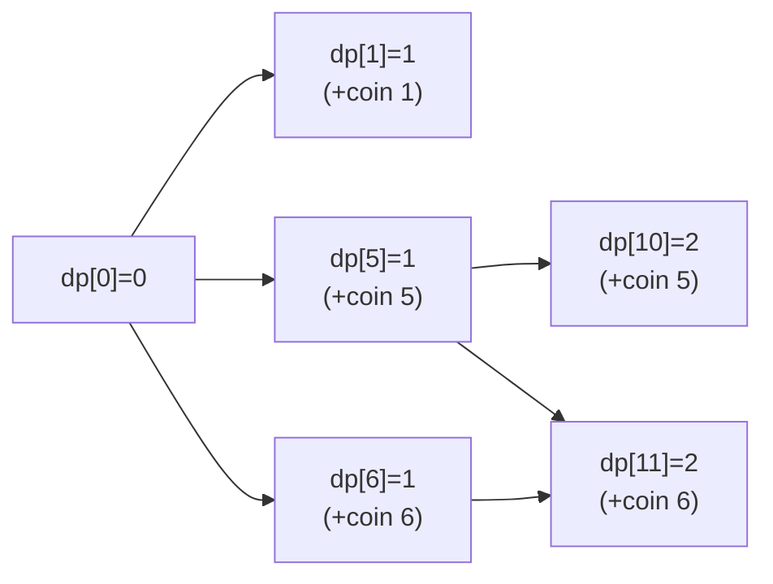

### Problem: Coin Change - Dynamic Programming

---

### Short Revision Notes (Exam Quick Recall)

- Pattern: Unbounded Knapsack / Bottom-up DP
- Core Idea: `dp[i]` = min coins to make amount `i`; for each coin, `dp[i] = min(dp[i], dp[i-coin]+1)`
- Key Trick: Initialize `dp[0]=0`, all others = ∞; works for ANY coin set
- Complexity: O(amount × coins) time, O(amount) space

---

### Code Snippet (Important Part Only)

```cpp
vector<int> dp(amount + 1, INT_MAX);
dp[0] = 0;
for (int i = 1; i <= amount; i++)
    for (int coin : coins)
        if (coin <= i && dp[i - coin] != INT_MAX)
            dp[i] = min(dp[i], dp[i - coin] + 1);
return dp[amount] == INT_MAX ? -1 : dp[amount];
```

---

### Detailed Explanation

- Build `dp` array of size `amount+1`.
- `dp[0] = 0` (base case: 0 coins for amount 0).
- For each amount `i` from 1 to target, try all coins; if `coin ≤ i` and `dp[i-coin]` is reachable, update `dp[i]`.
- Final answer is `dp[amount]`; if still ∞ → impossible.

**Why it works:** Every amount is built optimally from smaller sub-amounts (optimal substructure). Each coin can be reused (unbounded knapsack pattern).

**Edge cases:**
- Amount = 0: answer is 0
- No valid combination: return -1
- Single coin that divides amount: dp fills cleanly

**Common mistakes:**
- Forgetting to check `dp[i-coin] != INT_MAX` before adding 1 (causes overflow)
- Using `amount` instead of `amount+1` for dp size
- Initializing dp[0] to something other than 0

---

### Dry Run

Coins: {1,5,6,9}, Amount: 11

| i  | dp[i] | via coin |
|----|-------|----------|
| 0  | 0     | -        |
| 1  | 1     | 1        |
| 5  | 1     | 5        |
| 6  | 1     | 6        |
| 9  | 1     | 9        |
| 10 | 2     | 5+5      |
| 11 | 2     | 5+6      |

Answer: 2 (coins 5+6)

---

### Visualization (USE MERMAID ONLY, NO ASCII)


