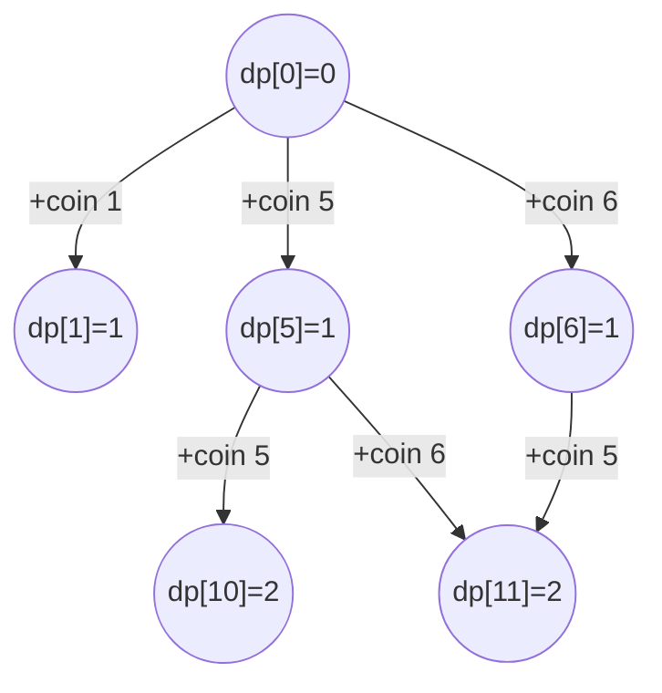

### Problem: Coin Change - Dynamic Programming

---

### Short Revision Notes (Exam Quick Recall)

- **Pattern**: Unbounded Knapsack / Bottom-up DP.
- **Core Idea**: `dp[i]` = min coins to make amount `i`; for each coin, `dp[i] = min(dp[i], dp[i-coin]+1)`.
- **Key Trick**: Initialize `dp[0]=0`, all others = `INT_MAX`. This approach works for ANY coin set, unlike Greedy.
- **Complexity**: O(amount × coins) time, O(amount) space.

---

### Code Snippet (Important Part Only)

```cpp
int coinChangeDP(const vector<int>& coins, int amount) {
    vector<int> dp(amount + 1, INT_MAX);
    dp[0] = 0;

    for (int i = 1; i <= amount; i++) {
        for (int coin : coins) {
            if (coin <= i && dp[i - coin] != INT_MAX)
                dp[i] = min(dp[i], dp[i - coin] + 1);
        }
    }
    return dp[amount] == INT_MAX ? -1 : dp[amount];
}
```

---

### Detailed Explanation

```cpp
    vector<int> dp(amount + 1, INT_MAX);
```
- Build a `dp` array of size `amount + 1` to store the minimum number of coins needed for each amount up to the target. Initialize all values to `INT_MAX` (infinity) to represent unreachable amounts initially.

```cpp
    dp[0] = 0;
```
- **Base case**: To make amount 0, we need exactly 0 coins.

```cpp
    for (int i = 1; i <= amount; i++) {
```
- Iterate through every sub-amount from `1` up to `amount`. This is bottom-up DP; we solve smaller subproblems first to build the solution for the final amount.

```cpp
        for (int coin : coins) {
```
- For the current amount `i`, try using every available coin in the `coins` array.

```cpp
            if (coin <= i && dp[i - coin] != INT_MAX)
```
- **Condition 1**: `coin <= i` ensures the coin isn't larger than the amount we are trying to make.
- **Condition 2**: `dp[i - coin] != INT_MAX` ensures the remaining amount (`i - coin`) is actually reachable. This prevents adding 1 to `INT_MAX`, which would cause integer overflow.

```cpp
                dp[i] = min(dp[i], dp[i - coin] + 1);
```
- **State Transition**: If both conditions are met, update `dp[i]` to be the minimum of its current value and the cost of making the remaining amount `dp[i - coin]` plus 1 (for the current coin being used).

```cpp
    return dp[amount] == INT_MAX ? -1 : dp[amount];
```
- After filling the DP table, check `dp[amount]`. If it is still `INT_MAX`, it means the target amount cannot be formed with the given coins, so return `-1`. Otherwise, return the computed minimum coins.

---

### Dry Run

**Coins**: `{1, 5, 6, 9}`, **Amount**: `11`

| `i`  | `dp[i]` | Coins evaluated (Updates) | Final `dp[i]` |
|------|---------|---------------------------|---------------|
| 0    | 0       | Base case                 | 0             |
| 1    | ∞       | coin 1: `dp[1] = dp[0]+1` | 1             |
| 2..4 | ∞       | Only coin 1 fits          | i             |
| 5    | 5       | coin 5: `dp[5] = dp[0]+1` | 1             |
| 6    | 2       | coin 6: `dp[6] = dp[0]+1` | 1             |
| 9    | 3       | coin 9: `dp[9] = dp[0]+1` | 1             |
| 10   | 2       | coin 5: `dp[10] = dp[5]+1`| 2             |
| 11   | 3       | coin 6: `dp[11] = dp[5]+1`<br>coin 5: `dp[11] = dp[6]+1`| 2 |

**Answer**: `2` (using coins 5 + 6)

---

### Visualization (USE MERMAID ONLY, NO ASCII)


