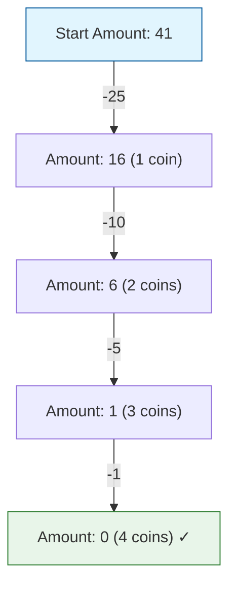

### Problem: Coin Change - Greedy

---

### Short Revision Notes (Exam Quick Recall)

- **Pattern**: Greedy (always pick the largest coin that fits).
- **Core Idea**: Sort coins in descending order, greedily subtract the largest coin possible until the amount becomes 0.
- **Key Trick**: Only correct for **canonical coin systems** (e.g. US currency: `{1, 5, 10, 25}`). Fails to find the optimal solution for arbitrary/non-canonical systems.
- **Complexity**: O(A / min_coin) time where A = amount, O(1) auxiliary space (excluding sort).

---

### Code Snippet (Important Part Only)

```cpp
int coinChangeGreedy(vector<int> coins, int amount) {
    sort(coins.rbegin(), coins.rend());
    int count = 0;
    
    for (int coin : coins) {
        while (amount >= coin) {
            amount -= coin;
            count++;
        }
    }
    
    if (amount != 0) return -1;
    return count;
}
```

---

### Detailed Explanation

```cpp
    sort(coins.rbegin(), coins.rend());
```
- Sort the available `coins` array in descending order (`rbegin` to `rend`). This ensures we always try the largest available denomination first, which is the core principle of this greedy approach.

```cpp
    int count = 0;
```
- Initialize a `count` variable to keep track of the total number of coins used.

```cpp
    for (int coin : coins) {
```
- Iterate through each `coin` in the sorted array, starting from the largest denomination down to the smallest.

```cpp
        while (amount >= coin) {
```
- Use a `while` loop to repeatedly use the current `coin` as long as it fits into the remaining `amount`.

```cpp
            amount -= coin;
            count++;
        }
```
- Deduct the `coin` value from the `amount` and increment the `count` of coins used. This greedily takes as many of the current largest coin as possible before moving to the next smaller denomination.

```cpp
    if (amount != 0) return -1;
    return count;
```
- After checking all coins, if `amount` is not exactly `0`, it means exact change cannot be made with the greedy strategy (or at all), so return `-1`. Otherwise, return the total `count` of coins.

---

### Dry Run

**Scenario 1: Canonical System (Greedy Works)**
- **Coins**: `{1, 5, 10, 25}`, **Amount**: `41`
- **Sort**: `{25, 10, 5, 1}`
- **Step 1**: `25` fits (41 ≥ 25). Use `25`. Remaining: `16`, Count: `1`.
- **Step 2**: `10` fits (16 ≥ 10). Use `10`. Remaining: `6`, Count: `2`.
- **Step 3**: `5` fits (6 ≥ 5). Use `5`. Remaining: `1`, Count: `3`.
- **Step 4**: `1` fits (1 ≥ 1). Use `1`. Remaining: `0`, Count: `4`.
- **Result**: `4` coins (25 + 10 + 5 + 1).

**Scenario 2: Non-Canonical System (Greedy Fails)**
- **Coins**: `{1, 3, 4}`, **Amount**: `6`
- **Sort**: `{4, 3, 1}`
- **Step 1**: Use `4` (Remaining: `2`).
- **Step 2**: Use `1` (Remaining: `1`).
- **Step 3**: Use `1` (Remaining: `0`).
- **Result**: Greedy gives `3` coins (4 + 1 + 1).
- **Optimal (via DP)**: `2` coins (3 + 3).

---

### Visualization (USE MERMAID ONLY, NO ASCII)


