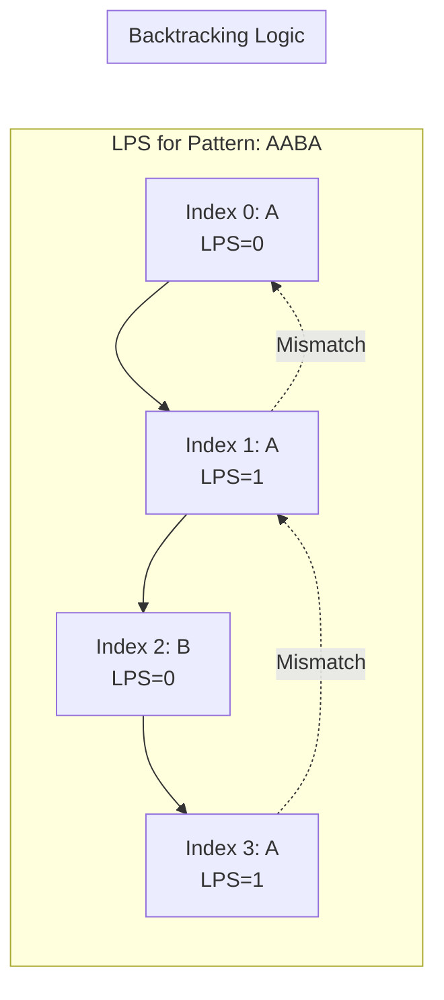

### Problem: KMP (Knuth-Morris-Pratt) Pattern Searching

---

### Short Revision Notes (Exam Quick Recall)

- **Pattern**: String matching with failure function.
- **Core Idea**: Precompute an LPS (Longest Proper Prefix which is also Suffix) array to skip redundant comparisons.
- **Key Trick**: On mismatch, don't reset `j` to 0; reset to `lps[j-1]` to reuse the already matched prefix.
- **Complexity**: O(n + m) time, O(m) space (n = text length, m = pattern length).

---

### Code Snippet (Important Part Only)

```cpp
vector<int> buildLPS(const string& pat) {
    int n = pat.size();
    vector<int> lps(n, 0);
    int len = 0, i = 1;
    while (i < n) {
        if (pat[i] == pat[len]) {
            lps[i++] = ++len;
        } else if (len) {
            len = lps[len - 1];
        } else {
            lps[i++] = 0;
        }
    }
    return lps;
}

vector<int> kmpSearch(const string& text, const string& pat) {
    if (pat.empty()) return {};
    vector<int> lps = buildLPS(pat);
    vector<int> matches;
    int i = 0, j = 0;
    int n = text.size(), m = pat.size();
    while (i < n) {
        if (text[i] == pat[j]) { i++; j++; }
        if (j == m) {
            matches.push_back(i - j);
            j = lps[j - 1];
        } else if (i < n && text[i] != pat[j]) {
            j ? (j = lps[j - 1]) : i++;
        }
    }
    return matches;
}
```

---

### Detailed Explanation

**1. Building the LPS Array:**

```cpp
    int n = pat.size();
    vector<int> lps(n, 0);
    int len = 0, i = 1;
```
- `len` stores the length of the previous longest prefix suffix.
- `i` iterates through the pattern starting from index 1 (since `lps[0]` is always 0).

```cpp
        if (pat[i] == pat[len]) {
            lps[i++] = ++len;
        }
```
- If the characters match, it means we can extend the current prefix. We increment `len` and store it in `lps[i]`, then move `i` forward.

```cpp
        } else if (len) {
            len = lps[len - 1];
        }
```
- If there's a mismatch but `len > 0`, we do not increment `i`. Instead, we backtrack `len` to the length of the next longest prefix suffix (`lps[len - 1]`) and try again. This prevents rescanning.

```cpp
        } else {
            lps[i++] = 0;
        }
```
- If `len` is 0 and there's a mismatch, there is no prefix that is also a suffix up to `i`. We set `lps[i]` to 0 and move `i` forward.

**2. KMP Search:**

```cpp
    while (i < n) {
        if (text[i] == pat[j]) { i++; j++; }
```
- Iterate through the text. If characters match, increment both pointers `i` (for text) and `j` (for pattern).

```cpp
        if (j == m) {
            matches.push_back(i - j);
            j = lps[j - 1];
        }
```
- If `j` reaches the pattern length `m`, a full match is found at starting index `i - j`. We record it.
- To find potential overlapping matches, we do not reset `j` to 0. We backtrack `j` to `lps[j - 1]`.

```cpp
        } else if (i < n && text[i] != pat[j]) {
            j ? (j = lps[j - 1]) : i++;
        }
```
- On a mismatch, if `j > 0`, we backtrack `j` using the LPS array (`j = lps[j - 1]`) to avoid rescanning the text. If `j == 0`, we just advance `i` since there's no matched prefix to reuse.

---

### Dry Run

**Pattern:** `"AABA"`, **LPS Build:**

| `i` | `pat[i]` | `len` | Action | `lps[i]` |
|---|---|---|---|---|
| 0 | A | 0 | Init | 0 |
| 1 | A | 1 | `pat[1]==pat[0]` → `len=1` | 1 |
| 2 | B | 0 | `pat[2]!=pat[1]`, `len>0` → `len=lps[0]=0` | 0 |
| 2 | B | 0 | `pat[2]!=pat[0]`, `len=0` → set `lps=0`, `i++` | 0 |
| 3 | A | 1 | `pat[3]==pat[0]` → `len=1` | 1 |

**LPS Array:** `[0, 1, 0, 1]`

**Search Text:** `"AABAACAADAABAABA"`, **Pattern:** `"AABA"`
- Matches perfectly up to index 3. Found match at `i - j` = `4 - 4 = 0`.
- Update `j = lps[3] = 1`.
- `text[4] ('A') != pat[1] ('A')` → Match! `i=5, j=2`.
- `text[5] ('C') != pat[2] ('B')`. Mismatch! `j = lps[1] = 1`.
- `text[5] ('C') != pat[1] ('A')`. Mismatch! `j = lps[0] = 0`.
- `text[5] ('C') != pat[0] ('A')`. Mismatch! `i++` (i=6).
- Continues efficiently without stepping back in `i`.

---

### Visualization (USE MERMAID ONLY, NO ASCII)


