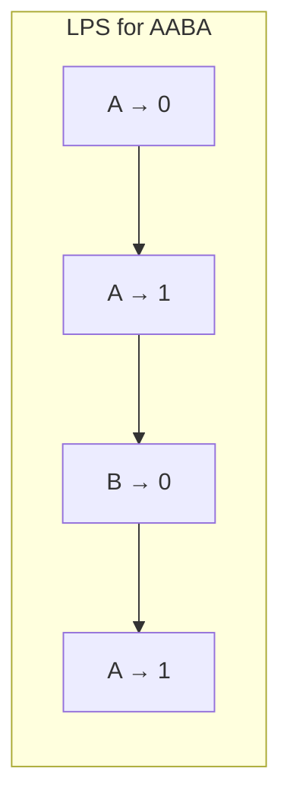

### Problem: KMP (Knuth-Morris-Pratt) Pattern Matching

---

### Short Revision Notes (Exam Quick Recall)

- Pattern: String matching with failure function
- Core Idea: Precompute LPS (Longest Proper Prefix which is also Suffix) to skip redundant comparisons
- Key Trick: On mismatch, don't reset `j` to 0; reset to `lps[j-1]` to reuse already matched prefix
- Complexity: O(n + m) time, O(m) space (n = text length, m = pattern length)

---

### Code Snippet (Important Part Only)

```cpp
// Build LPS
while (i < m) {
    if (pat[i] == pat[len]) { lps[i++] = ++len; }
    else if (len)            { len = lps[len-1]; }  // don't increment i
    else                     { lps[i++] = 0; }
}

// Search
while (i < n) {
    if (text[i] == pat[j]) { i++; j++; }
    if (j == m) { matches.push_back(i-j); j = lps[j-1]; }
    else if (i < n && text[i] != pat[j])
        j ? (j = lps[j-1]) : i++;
}
```

---

### Detailed Explanation

- **LPS array:** For pattern position `i`, `lps[i]` = length of longest proper prefix of `pat[0..i]` that is also a suffix.
- **Search:** Use two pointers `i` (text) and `j` (pattern). On match, advance both. On full match, record position and use `lps[j-1]` to continue. On mismatch, if `j>0` use `lps[j-1]` to backtrack `j` only (not `i`).

**Why it works:** LPS encodes how much of the pattern can be reused after a mismatch, eliminating re-scanning of the text.

**Edge cases:**
- Pattern longer than text: no matches
- Overlapping matches: handled by `j = lps[j-1]` after match
- Empty pattern: not supported; add a guard (`if (pat.empty()) return {}`) before entering the search loop

**Common mistakes:**
- Resetting `j=0` on mismatch (that's naive O(nm), not KMP)
- Off-by-one in `lps` array building (not incrementing `i` when `len>0` and mismatch)

---

### Dry Run

Pattern: "AABA", LPS build:

| i | pat[i] | len | lps[i] |
|---|--------|-----|--------|
| 0 | A      | 0   | 0      |
| 1 | A      | 1   | 1      |
| 2 | B      | 0   | 0      |
| 3 | A      | 1   | 1      |

LPS = [0, 1, 0, 1]

Search "AABAACAADAABAABA" for "AABA":  
Matches at indices: 0, 9, 12

---

### Visualization (USE MERMAID ONLY, NO ASCII)


