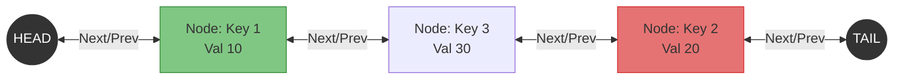

### Problem: LRU Cache (Least Recently Used)

---

### Short Revision Notes (Exam Quick Recall)

- **Pattern**: Doubly Linked List (DLL) + HashMap.
- **Core Idea**: DLL maintains access order (Most Recently Used at the front, LRU at the back). HashMap provides O(1) node lookup by key.
- **Key Trick**: Use dummy head and tail nodes to simplify inserting/removing at ends without checking for nulls.
- **Complexity**: O(1) time for both `get` and `put`, O(capacity) space.

---

### Code Snippet (Important Part Only)

```cpp
int get(int key) {
    if (!cache.count(key)) return -1;
    Node* node = cache[key];
    remove(node);
    insertFront(node);
    return node->val;
}

void put(int key, int val) {
    if (capacity <= 0) return;
    if (cache.count(key)) {
        cache[key]->val = val;
        remove(cache[key]);
        insertFront(cache[key]);
    } else {
        if ((int)cache.size() == capacity) {
            Node* lru = tail->prev;
            remove(lru);
            cache.erase(lru->key);
            delete lru;
        }
        Node* node = new Node(key, val);
        cache[key] = node;
        insertFront(node);
    }
}
```

---

### Detailed Explanation

```cpp
int get(int key) {
    if (!cache.count(key)) return -1;
```
- First, check the hash map. If the key doesn't exist, return `-1`.

```cpp
    Node* node = cache[key];
    remove(node);
    insertFront(node);
    return node->val;
}
```
- If the key exists, fetch its node pointer from the hash map.
- Since it was just accessed, it's now the Most Recently Used (MRU). We `remove` it from its current position in the DLL and `insertFront` (right after the dummy head).
- Return its value.

```cpp
void put(int key, int val) {
    if (capacity <= 0) return;
    if (cache.count(key)) {
```
- For a `put` operation, handle the edge case of 0 capacity. Then check if the key is already in the cache.

```cpp
        cache[key]->val = val;
        remove(cache[key]);
        insertFront(cache[key]);
```
- If the key exists, update its value. Then, like `get`, `remove` it and `insertFront` to mark it as the MRU.

```cpp
    } else {
        if ((int)cache.size() == capacity) {
            Node* lru = tail->prev;
            remove(lru);
            cache.erase(lru->key);
            delete lru;
        }
```
- If the key is new, check if the cache is at full capacity.
- If full, find the LRU node, which is always right before the dummy `tail` (`tail->prev`).
- Remove it from the DLL, erase its key from the hash map, and delete the pointer to prevent memory leaks.

```cpp
        Node* node = new Node(key, val);
        cache[key] = node;
        insertFront(node);
    }
}
```
- Finally, create the new node, add it to the hash map, and insert it at the front of the DLL (marking it as the new MRU).

---

### Dry Run

Capacity = `3`, operations: `put(1,10), put(2,20), put(3,30), get(1), put(4,40)`

1. `put(1,10)`: Cache = `[1:10]`
2. `put(2,20)`: Cache = `[2:20] -> [1:10]` (MRU -> LRU)
3. `put(3,30)`: Cache = `[3:30] -> [2:20] -> [1:10]`
4. `get(1)`: Key 1 exists (returns 10). Move to front.
   - Cache = `[1:10] -> [3:30] -> [2:20]`
5. `put(4,40)`: Cache is full (size 3). 
   - Evict LRU: Node `[2:20]` at the tail end is removed.
   - Insert new MRU: `[4:40]`.
   - Cache = `[4:40] -> [1:10] -> [3:30]`

---

### Visualization (USE MERMAID ONLY, NO ASCII)


