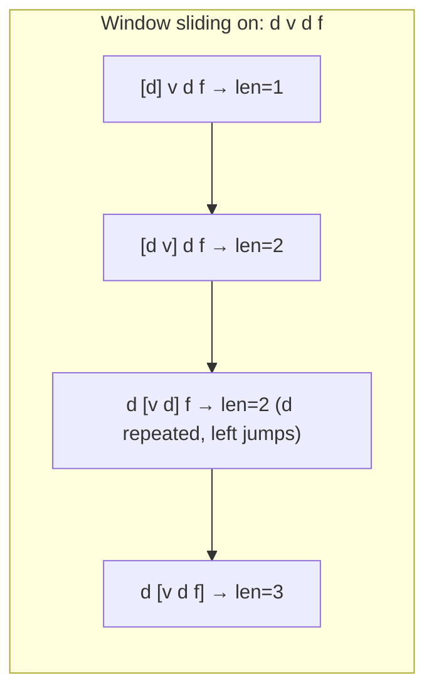

### Problem: Longest Substring Without Repeating Characters

---

### Short Revision Notes (Exam Quick Recall)

- Pattern: Sliding Window + HashMap
- Core Idea: Maintain a window [left, right]; when a character repeats inside window, shrink left past its last occurrence
- Key Trick: Store `char → last seen index`; jump left to `last[char]+1` (not just left+1)
- Complexity: O(n) time, O(min(n, charset)) space

---

### Code Snippet (Important Part Only)

```cpp
unordered_map<char, int> last;
int left = 0, maxLen = 0;
for (int right = 0; right < n; right++) {
    if (last.count(s[right]) && last[s[right]] >= left)
        left = last[s[right]] + 1;  // shrink window
    last[s[right]] = right;
    maxLen = max(maxLen, right - left + 1);
}
```

---

### Detailed Explanation

- `right` expands the window, `left` marks the window start.
- When `s[right]` was seen before AND its last position is within the current window (`>= left`), move `left` to `last[s[right]] + 1`.
- Always update `last[s[right]] = right` and compute window size.

**Why it works:** The condition `last[s[right]] >= left` ensures we only shrink when the duplicate is actually inside the current window (not a stale entry from a previous window).

**Edge cases:**
- All unique characters: window grows to full string
- All same characters: window is always 1
- Empty string: return 0

**Common mistakes:**
- Using a set and shrinking left one-by-one (O(n) inner loop, not truly O(n))
- Not checking `last[char] >= left` (stale entries cause wrong left jump)

---

### Dry Run

s = "dvdf"

| right | s[right] | left | last      | window | maxLen |
|-------|----------|------|-----------|--------|--------|
| 0     | d        | 0    | {d:0}     | "d"    | 1      |
| 1     | v        | 0    | {d:0,v:1} | "dv"   | 2      |
| 2     | d        | 1    | {d:2,v:1} | "vd"   | 2      |
| 3     | f        | 1    | ...       | "vdf"  | 3      |

Answer: 3 ("vdf")

---

### Visualization (USE MERMAID ONLY, NO ASCII)


