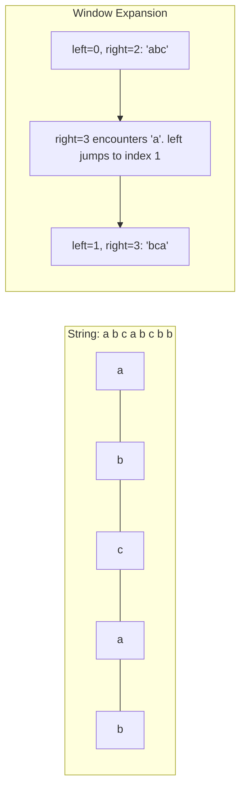

### Problem: Longest Substring Without Repeating Characters

---

### Short Revision Notes (Exam Quick Recall)

- **Pattern**: Sliding Window + HashMap.
- **Core Idea**: Use a window defined by `[left, right]`. Expand `right` character by character. If a duplicate is found, shrink `left` past the duplicate's last known index.
- **Key Trick**: Store the *index* of characters in the HashMap instead of counts. On collision, jump `left` directly to `last_index + 1`.
- **Complexity**: O(n) time, O(min(n, m)) space where m is the character set size.

---

### Code Snippet (Important Part Only)

```cpp
int lengthOfLongestSubstring(const string& s) {
    unordered_map<char, int> last;
    int left = 0, maxLen = 0;

    for (int right = 0; right < (int)s.size(); right++) {
        if (last.count(s[right]) && last[s[right]] >= left) {
            left = last[s[right]] + 1;
        }
        last[s[right]] = right;
        maxLen = max(maxLen, right - left + 1);
    }
    return maxLen;
}
```

---

### Detailed Explanation

```cpp
    unordered_map<char, int> last;
    int left = 0, maxLen = 0;
```
- `last` maps each character to its most recently seen index.
- `left` is the start of our current valid sliding window.
- `maxLen` keeps track of the longest valid substring found so far.

```cpp
    for (int right = 0; right < (int)s.size(); right++) {
```
- The `right` pointer expands the window one character at a time.

```cpp
        if (last.count(s[right]) && last[s[right]] >= left) {
            left = last[s[right]] + 1;
        }
```
- We check if the current character `s[right]` has been seen before AND its last index is inside our current window (`>= left`).
- If it is, we have a repeating character. We instantly jump the `left` pointer to the position *after* the previous occurrence (`last[s[right]] + 1`). This is much faster than inching `left` forward one by one.

```cpp
        last[s[right]] = right;
```
- Regardless of whether it was a duplicate or not, we update the `last` seen index of `s[right]` to the current `right` pointer index.

```cpp
        maxLen = max(maxLen, right - left + 1);
    }
    return maxLen;
```
- At each step, the current window size is `right - left + 1`. We update `maxLen` if this window is the largest we've seen.
- Return the maximum length found.

---

### Dry Run

**Input:** `"abcabcbb"`

| `right` | Char | `last` Map | `left` Logic | `left` | Window | `maxLen` |
|---------|------|------------|--------------|--------|--------|----------|
| 0       | `a`  | `{a:0}`    | -            | 0      | "a"    | 1        |
| 1       | `b`  | `{a:0, b:1}` | -          | 0      | "ab"   | 2        |
| 2       | `c`  | `{a:0, b:1, c:2}` | -     | 0      | "abc"  | 3        |
| 3       | `a`  | `{a:3,...}`| `last['a'] >= 0` → `left = 0+1=1` | 1 | "bca" | 3 |
| 4       | `b`  | `{b:4,...}`| `last['b'] >= 1` → `left = 1+1=2` | 2 | "cab" | 3 |
| 5       | `c`  | `{c:5,...}`| `last['c'] >= 2` → `left = 2+1=3` | 3 | "abc" | 3 |
| 6       | `b`  | `{b:6,...}`| `last['b'] >= 3` → `left = 4+1=5` | 5 | "cb"  | 3 |
| 7       | `b`  | `{b:7,...}`| `last['b'] >= 5` → `left = 6+1=7` | 7 | "b"   | 3 |

**Result:** `3`

---

### Visualization (USE MERMAID ONLY, NO ASCII)


