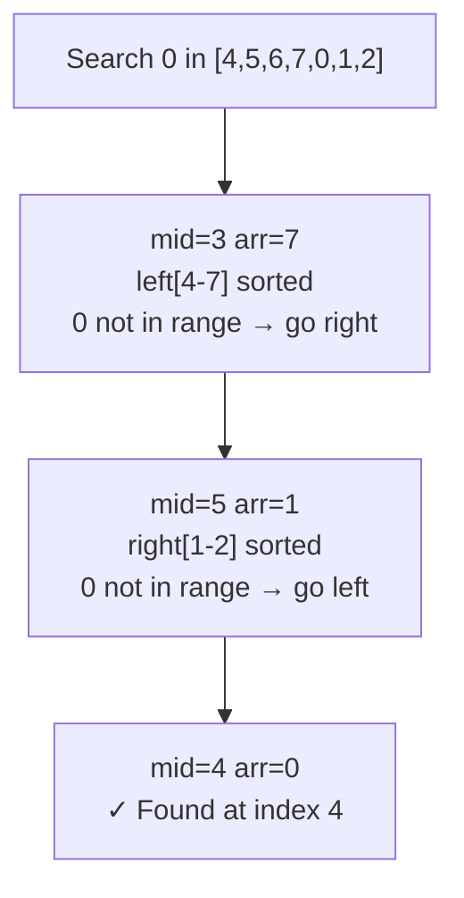

### Problem: Search in Rotated Sorted Array

---

### Short Revision Notes (Exam Quick Recall)

- Pattern: Modified Binary Search
- Core Idea: One half is always sorted; check if target is in sorted half, else search the other half
- Key Trick: `arr[low] <= arr[mid]` → left half is sorted; else right half is sorted
- Complexity: O(log n) time, O(1) space

---

### Code Snippet (Important Part Only)

```cpp
while (low <= high) {
    int mid = low + (high - low) / 2;
    if (arr[mid] == target) return mid;

    if (arr[low] <= arr[mid]) {         // left half sorted
        if (target >= arr[low] && target < arr[mid])
            high = mid - 1;             // target in left half
        else
            low = mid + 1;
    } else {                            // right half sorted
        if (target > arr[mid] && target <= arr[high])
            low = mid + 1;              // target in right half
        else
            high = mid - 1;
    }
}
```

---

### Detailed Explanation

- In a rotated sorted array, at least one half is always sorted.
- At each step, identify which half is sorted by comparing `arr[low]` with `arr[mid]`.
- Check if the target falls within the sorted half's range. If yes, search that half; else search the other.

**Why it works:** Even though the array is rotated, binary search still works because we can always determine which half is fully sorted and check membership in O(1).

**Edge cases:**
- No rotation (already sorted): works as standard binary search
- Single element: works
- Target not present: returns -1
- Duplicates: this approach can fail (use modified logic with `low++, high--` for duplicates)

**Common mistakes:**
- Using `<` instead of `<=` for `arr[low] <= arr[mid]` (misses the case where low==mid)
- Incorrect boundary checks when determining target's half

---

### Dry Run

Array: `[4, 5, 6, 7, 0, 1, 2]`, target = 0

| low | high | mid | arr[mid] | action |
|-----|------|-----|----------|--------|
| 0   | 6    | 3   | 7        | left sorted [4..7]; 0 not in [4,7) → right: low=4 |
| 4   | 6    | 5   | 1        | right sorted [1..2]; 0 not in (1,2] → left: high=4 |
| 4   | 4    | 4   | 0        | **found at index 4** |

---

### Visualization (USE MERMAID ONLY, NO ASCII)


