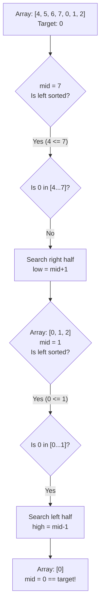

### Problem: Search in Rotated Sorted Array

---

### Short Revision Notes (Exam Quick Recall)

- **Pattern**: Modified Binary Search.
- **Core Idea**: In a rotated sorted array, one half (either left to mid, or mid to right) is *always* perfectly sorted.
- **Key Trick**: Identify which half is sorted first. Then check if the target falls within the value range of that sorted half. If yes, search there; otherwise, search the other half.
- **Complexity**: O(log n) time, O(1) space.

---

### Code Snippet (Important Part Only)

```cpp
int searchRotated(const vector<int>& arr, int target) {
    int low = 0, high = (int)arr.size() - 1;

    while (low <= high) {
        int mid = low + (high - low) / 2;
        if (arr[mid] == target) return mid;

        if (arr[low] <= arr[mid]) {
            if (target >= arr[low] && target < arr[mid])
                high = mid - 1;
            else
                low = mid + 1;
        } else { 
            if (target > arr[mid] && target <= arr[high])
                low = mid + 1;
            else
                high = mid - 1;
        }
    }
    return -1;
}
```

---

### Detailed Explanation

```cpp
    int low = 0, high = (int)arr.size() - 1;
    while (low <= high) {
        int mid = low + (high - low) / 2;
        if (arr[mid] == target) return mid;
```
- Setup standard binary search bounds. Calculate `mid` safely to avoid integer overflow.
- If `arr[mid]` is the target, we found it and return its index immediately.

```cpp
        if (arr[low] <= arr[mid]) {
```
- This condition checks if the **left half** (`low` to `mid`) is perfectly sorted without any rotation pivot inside it.

```cpp
            if (target >= arr[low] && target < arr[mid])
                high = mid - 1;
            else
                low = mid + 1;
```
- If the left half is sorted, we check if the `target` falls geographically within its bounds (between `arr[low]` and `arr[mid]`).
- If it does, we discard the right half by setting `high = mid - 1`.
- If it does not, the target MUST be in the right half, so we discard the left half by setting `low = mid + 1`.

```cpp
        } else { 
```
- If `arr[low] <= arr[mid]` is false, it means the rotation pivot is in the left half. Therefore, the **right half** (`mid` to `high`) MUST be perfectly sorted.

```cpp
            if (target > arr[mid] && target <= arr[high])
                low = mid + 1;
            else
                high = mid - 1;
        }
```
- Since the right half is sorted, we check if the `target` lies within its bounds (between `arr[mid]` and `arr[high]`).
- If it does, discard the left half (`low = mid + 1`).
- If it doesn't, discard the right half (`high = mid - 1`).

```cpp
    }
    return -1;
```
- If the loop exits and we haven't found the target, it's not in the array. Return `-1`.

---

### Dry Run

**Array:** `[4, 5, 6, 7, 0, 1, 2]`, **Target:** `0`

1. `low=0`, `high=6`, `mid=3`. `arr[3]=7`.
   - Is left half `[4, 5, 6, 7]` sorted? Yes, `arr[0] <= arr[3]` (4 <= 7).
   - Is `target` (0) between 4 and 7? No.
   - Therefore, search right: `low = mid + 1 = 4`.
2. `low=4`, `high=6`, `mid=5`. `arr[5]=1`.
   - Is left half `[0, 1]` sorted? Yes, `arr[4] <= arr[5]` (0 <= 1).
   - Is `target` (0) between 0 and 1? Yes, it is exactly at `low`.
   - Search left: `high = mid - 1 = 4`.
3. `low=4`, `high=4`, `mid=4`. `arr[4]=0`.
   - `arr[4] == 0`. Target found! Return index `4`.

---

### Visualization (USE MERMAID ONLY, NO ASCII)


