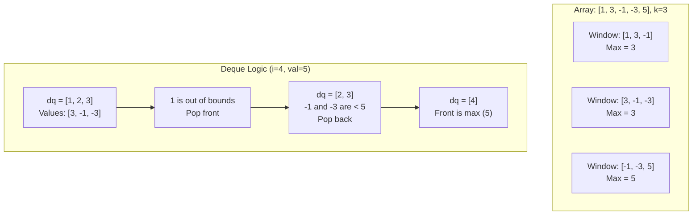

### Problem: Sliding Window Maximum

---

### Short Revision Notes (Exam Quick Recall)

- **Pattern**: Monotonic Deque.
- **Core Idea**: Use a double-ended queue (`deque`) to store array *indices*. Maintain a monotonically decreasing property in the deque (largest element index at the front).
- **Key Trick**: For each element, pop smaller elements from the back (they can't be maximums anymore). Pop elements from the front if they fall outside the current sliding window of size `k`.
- **Complexity**: O(n) time (each element is pushed and popped at most once), O(k) space.

---

### Code Snippet (Important Part Only)

```cpp
vector<int> slidingWindowMax(const vector<int>& arr, int k) {
    deque<int> dq; // stores indices
    vector<int> result;

    for (int i = 0; i < (int)arr.size(); i++) {
        if (!dq.empty() && dq.front() <= i - k)
            dq.pop_front();

        while (!dq.empty() && arr[dq.back()] < arr[i])
            dq.pop_back();

        dq.push_back(i);

        if (i >= k - 1)
            result.push_back(arr[dq.front()]);
    }
    return result;
}
```

---

### Detailed Explanation

```cpp
    deque<int> dq; // stores indices
    vector<int> result;
```
- `dq` stores the **indices** (not the actual values) of array elements. This helps us easily check if an element has fallen out of the sliding window.
- The `deque` will be maintained such that the element at `dq.front()` is always the maximum element for the current window.

```cpp
    for (int i = 0; i < (int)arr.size(); i++) {
```
- Iterate through the array. `i` acts as the right edge of our sliding window.

```cpp
        if (!dq.empty() && dq.front() <= i - k)
            dq.pop_front();
```
- **Step 1: Remove out-of-bounds elements.** The valid window is from index `i - k + 1` to `i`. If the index at the front of the deque (`dq.front()`) is `i - k` or smaller, it is no longer in the window, so we pop it from the front.

```cpp
        while (!dq.empty() && arr[dq.back()] < arr[i])
            dq.pop_back();
```
- **Step 2: Maintain monotonic decreasing order.** Before inserting the current element `arr[i]`, we look at the back of the deque. Any elements smaller than `arr[i]` are useless because `arr[i]` is bigger and will stay in the window longer. We pop them from the back.

```cpp
        dq.push_back(i);
```
- **Step 3: Insert current element.** We push the current index `i` into the back of the deque.

```cpp
        if (i >= k - 1)
            result.push_back(arr[dq.front()]);
    }
```
- **Step 4: Record maximum.** Once `i` reaches `k - 1`, we have fully formed our first window of size `k`. From this point on, for every `i`, the maximum of the current window is guaranteed to be at `dq.front()`. We push its value to our `result`.

---

### Dry Run

**Array:** `[1, 3, -1, -3, 5]`, **k = 3**

| `i` | `arr[i]` | Step 1: Remove Old | Step 2: Remove Small | `dq` (indices) | Step 4: Result Max (`dq.front()`) |
|-----|----------|--------------------|----------------------|----------------|-----------------------------------|
| 0   | 1        | -                  | -                    | `[0]`          | (window size < 3)                 |
| 1   | 3        | -                  | pop `0` (1 < 3)      | `[1]`          | (window size < 3)                 |
| 2   | -1       | -                  | -                    | `[1, 2]`       | `arr[1] = 3`                      |
| 3   | -3       | -                  | -                    | `[1, 2, 3]`    | `arr[1] = 3`                      |
| 4   | 5        | pop `1` (1 ≤ 4-3)  | pop `3`, pop `2`     | `[4]`          | `arr[4] = 5`                      |

**Result:** `[3, 3, 5]`

---

### Visualization (USE MERMAID ONLY, NO ASCII)


