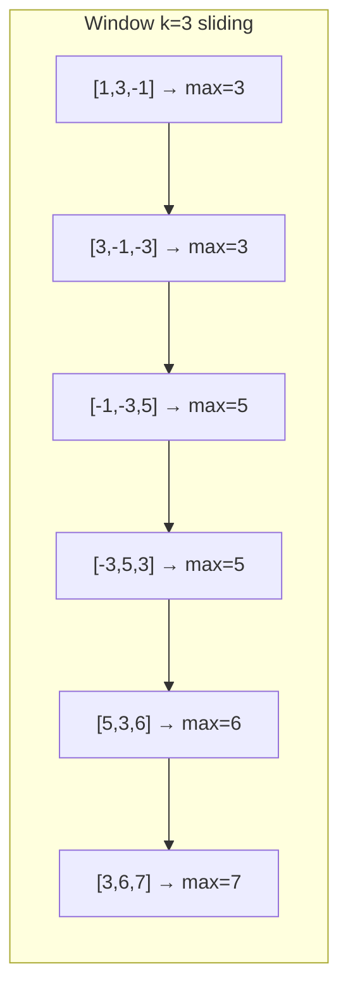

### Problem: Sliding Window Maximum Using Deque

---

### Short Revision Notes (Exam Quick Recall)

- Pattern: Monotonic Deque (decreasing)
- Core Idea: Maintain a deque of indices; front is always the max of the current window
- Key Trick: Remove back elements smaller than current (they can never be max); remove front if out of window
- Complexity: O(n) time, O(k) space (each element added/removed at most once)

---

### Code Snippet (Important Part Only)

```cpp
for (int i = 0; i < n; i++) {
    // Evict indices outside window
    if (!dq.empty() && dq.front() <= i - k)
        dq.pop_front();

    // Maintain decreasing order — remove smaller elements from back
    while (!dq.empty() && arr[dq.back()] < arr[i])
        dq.pop_back();

    dq.push_back(i);

    if (i >= k - 1)
        result.push_back(arr[dq.front()]);  // front = max
}
```

---

### Detailed Explanation

- The deque stores **indices** in decreasing order of their array values.
- **Before pushing:** Remove all back elements whose values are smaller than current (`arr[i]`) — they can't be the window max now or later.
- **Evict front:** If the front index is outside the current window (`<= i-k`), pop it.
- **Collect result:** Once window is full (`i >= k-1`), the front of deque is the window maximum.

**Why it works:** The deque always holds the "useful" candidates for max in decreasing order. The front is always the current window max.

**Edge cases:**
- k = 1: every element is its own max
- k = n: one result = max of entire array
- All same elements: deque keeps only one entry

**Common mistakes:**
- Using a queue instead of deque (need both front and back access)
- Storing values instead of indices (can't check window boundary)
- Wrong eviction condition: should be `<= i-k` not `< i-k`

---

### Dry Run

Array: `[1, 3, -1, -3, 5, 3, 6, 7]`, k=3

| i | arr[i] | dq (indices) | window max |
|---|--------|--------------|------------|
| 0 | 1      | [0]          | -          |
| 1 | 3      | [1]          | -          |
| 2 | -1     | [1,2]        | arr[1]=**3** |
| 3 | -3     | [1,2,3]      | arr[1]=**3** |
| 4 | 5      | [4]          | arr[4]=**5** |
| 5 | 3      | [4,5]        | arr[4]=**5** |
| 6 | 6      | [6]          | arr[6]=**6** |
| 7 | 7      | [7]          | arr[7]=**7** |

Result: `[3, 3, 5, 5, 6, 7]`

---

### Visualization (USE MERMAID ONLY, NO ASCII)


