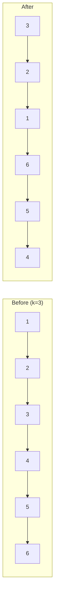

### Problem: Reverse Linked List in Groups of K

---

### Short Revision Notes (Exam Quick Recall)

- Pattern: Linked list manipulation with recursion
- Core Idea: Reverse exactly k nodes at a time, then recurse on the rest
- Key Trick: Check k nodes exist before reversing; previous head becomes tail, connect to recursive result
- Complexity: O(n) time, O(n/k) recursion stack

---

### Code Snippet (Important Part Only)

```cpp
Node* reverseKGroup(Node* head, int k) {
    // verify k nodes available
    Node* temp = head;
    for (int i = 0; i < k; i++) {
        if (!temp) return head;   // fewer than k nodes left → return as-is
        temp = temp->next;
    }
    // reverse k nodes in-place
    Node *curr = head, *prev = nullptr, *next = nullptr;
    for (int i = 0; i < k; i++) {
        next = curr->next;
        curr->next = prev;
        prev = curr; curr = next;
    }
    head->next = reverseKGroup(curr, k);  // head is now tail
    return prev;                           // prev is new head
}
```

---

### Detailed Explanation

- **Step 1:** Check if at least k nodes remain; if not, return head unchanged.
- **Step 2:** Reverse k nodes using the classic iterative 3-pointer technique.
- **Step 3:** After reversal, `head` (original first node) is the tail of the reversed segment. Connect it to the result of the recursive call on the remaining list.
- **Step 4:** Return `prev` which is the new head of the reversed segment.

**Why it works:** Each call handles exactly one k-group. Recursion handles remaining groups naturally.

**Edge cases:**
- Last group has fewer than k nodes → left unreversed (check at start)
- k = 1 → no change
- Empty list → return null

**Common mistakes:**
- Forgetting to check k availability before reversing (causes wrong output for tail group)
- Not reconnecting `head->next` after recursion

---

### Dry Run

Input: `1 -> 2 -> 3 -> 4 -> 5 -> 6 -> 7 -> 8`, k=3

**Call 1** (nodes 1-3): reverse → `3 -> 2 -> 1`, node 1's next = recurse(4, k=3)  
**Call 2** (nodes 4-6): reverse → `6 -> 5 -> 4`, node 4's next = recurse(7, k=3)  
**Call 3** (nodes 7-8): only 2 < 3, return as-is `7 -> 8`

Result: `3 -> 2 -> 1 -> 6 -> 5 -> 4 -> 7 -> 8`

---

### Visualization (USE MERMAID ONLY, NO ASCII)


