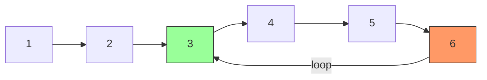

### Problem: Detect and Remove Loop in Linked List

---

### Short Revision Notes (Exam Quick Recall)

- Pattern: Floyd's Cycle Detection (Tortoise & Hare)
- Core Idea: slow=1 step, fast=2 steps; if they meet → loop exists
- Key Trick: After meeting, reset slow to head; advance both by 1 step until they meet again → loop start
- Complexity: O(n) time, O(1) space

---

### Code Snippet (Important Part Only)

```cpp
// Detect
Node *slow = head, *fast = head;
while (fast && fast->next) {
    slow = slow->next; fast = fast->next->next;
    if (slow == fast) break;  // loop detected
}

// Find loop start
slow = head;
while (slow->next != fast->next) {
    slow = slow->next; fast = fast->next;
}
fast->next = nullptr;  // remove loop
```

---

### Detailed Explanation

- **Phase 1 – Detect:** Fast moves 2x, slow moves 1x. If there's a loop they eventually meet inside it.
- **Phase 2 – Find start:** Reset slow to head. Move both one step at a time. They meet exactly at the loop start node.
- **Phase 3 – Remove:** Once at loop start, fast is at the last node of the loop (its next is the loop start). Set `fast->next = nullptr`.

**Why finding start works:** If loop start is at distance `d` from head, and loop length is `L`, the math shows slow & fast meet at exactly `d` steps from the loop start.

**Edge cases:**
- Loop starts at head itself (special case in code)
- Single node with self-loop
- No loop at all

**Common mistakes:**
- Using hash set (O(n) space, not optimal)
- Forgetting the special case where slow==fast immediately (loop at head)

---

### Dry Run

List: `1→2→3→4→5→6→3` (loop: 6 points back to 3)

| Step | slow | fast |
|------|------|------|
| 0    | 1    | 1    |
| 1    | 2    | 3    |
| 2    | 3    | 5    |
| 3    | 4    | 3    |
| 4    | 5    | 5    | ← meet at 5 |

Reset slow=1. Both advance by 1:  
slow: 1→2→3, fast: 5→6→3 → meet at 3 = loop start  
Set 6→next = null → loop removed.

---

### Visualization (USE MERMAID ONLY, NO ASCII)


