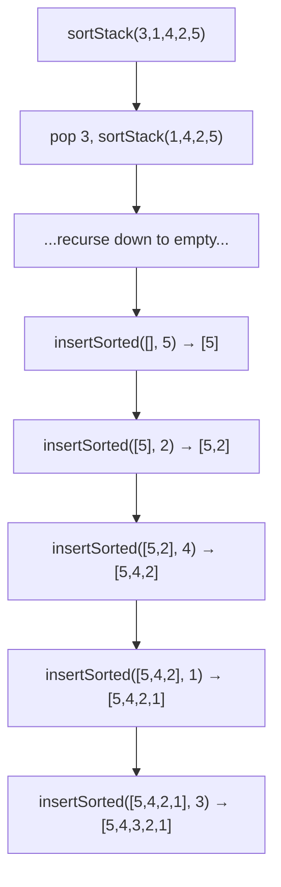

### Problem: Sort a Stack Using Recursion

---

### Short Revision Notes (Exam Quick Recall)

- Pattern: Recursion with auxiliary insertion
- Core Idea: Pop all elements recursively, then insert each one back in sorted position
- Key Trick: `sortStack` empties the stack via recursion; `insertSorted` places element at correct position
- Complexity: O(n²) time, O(n) recursion stack

---

### Code Snippet (Important Part Only)

```cpp
void insertSorted(stack<int>& st, int val) {
    if (st.empty() || st.top() <= val) { st.push(val); return; }
    int top = st.top(); st.pop();
    insertSorted(st, val);
    st.push(top);  // restore top
}

void sortStack(stack<int>& st) {
    if (st.empty()) return;
    int top = st.top(); st.pop();
    sortStack(st);          // sort remaining
    insertSorted(st, top);  // insert top in correct position
}
```

---

### Detailed Explanation

- **sortStack:** Pops the top element, recursively sorts the rest, then inserts the popped element in its correct sorted position.
- **insertSorted:** If the stack is empty or top ≤ value, just push. Otherwise, temporarily pop the top, recurse to find the right place, then restore the top.

**Why it works:** By the time `insertSorted` is called, the stack below is already sorted. We just need to find the right slot for the new value.

**Edge cases:**
- Empty stack: immediate return
- All same elements: no unnecessary swapping
- Already sorted: still O(n²) — no optimization for presorted

**Common mistakes:**
- Forgetting to push `top` back in `insertSorted` after recursion
- Confusing the direction of sorted order (largest at top vs bottom)

---

### Dry Run

Input stack (top→bottom): `3 1 4 2 5`

sortStack pops: 3, then 1, then 4, then 2, then 5  
Insert 5 into [] → [5]  
Insert 2 into [5] → [5, 2] (2 at bottom)  
Insert 4 into [5,2] → [5, 4, 2]  
Insert 1 → [5, 4, 2, 1]  
Insert 3 → [5, 4, 3, 2, 1]

---

### Visualization (USE MERMAID ONLY, NO ASCII)


