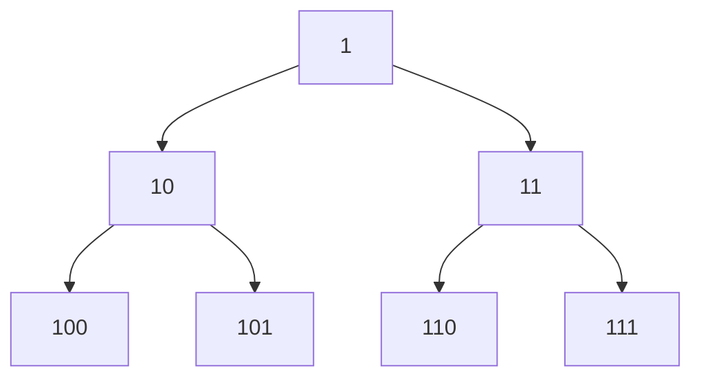

### Problem: Generate Binary Numbers from 1 to N Using Queue

---

### Short Revision Notes (Exam Quick Recall)

- Pattern: BFS-style level generation
- Core Idea: Start with "1"; for each dequeued string, enqueue string+"0" and string+"1"
- Key Trick: Queue ensures BFS order which naturally gives binary in ascending order
- Complexity: O(n) time and space

---

### Code Snippet (Important Part Only)

```cpp
void generateBinary(int n) {
    queue<string> q;
    q.push("1");
    for (int i = 0; i < n; i++) {
        string curr = q.front(); q.pop();
        cout << curr << "\n";
        q.push(curr + "0");
        q.push(curr + "1");
    }
}
```

---

### Detailed Explanation

- Enqueue "1" to start.
- For each of the n iterations: dequeue the front, print it, enqueue front+"0" and front+"1".
- The queue always holds the "next level" of binary numbers, maintaining correct order.

**Why it works:** Binary numbers in ascending order correspond exactly to BFS traversal of a complete binary tree where left child appends "0" and right child appends "1".

**Edge cases:**
- n=0: nothing printed
- n=1: prints "1"

**Common mistakes:**
- Using DFS (stack) instead of BFS (queue) — gives wrong order
- Integer overflow for large n — use strings, not ints

---

### Dry Run

n=5:  
Queue: ["1"]  
i=0: print "1", enqueue "10","11" → queue: ["10","11"]  
i=1: print "10", enqueue "100","101" → queue: ["11","100","101"]  
i=2: print "11", enqueue "110","111" → queue: ["100","101","110","111"]  
i=3: print "100" ...  
i=4: print "101"

Output: 1, 10, 11, 100, 101

---

### Visualization (USE MERMAID ONLY, NO ASCII)


