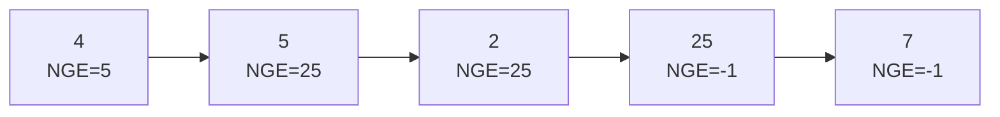

### Problem: Next Greater Element Using Stack

---

### Short Revision Notes (Exam Quick Recall)

- Pattern: Monotonic Stack (decreasing)
- Core Idea: Maintain a stack of indices; when current element > stack top's element, that's the NGE for the top
- Key Trick: Process left-to-right; elements without NGE remain in stack → result stays -1
- Complexity: O(n) time, O(n) space

---

### Code Snippet (Important Part Only)

```cpp
for (int i = 0; i < n; i++) {
    while (!st.empty() && arr[st.top()] < arr[i]) {
        result[st.top()] = arr[i];  // arr[i] is NGE for stack top
        st.pop();
    }
    st.push(i);
}
// remaining indices in stack → NGE = -1 (default)
```

---

### Detailed Explanation

- Traverse left to right, maintain a monotonic decreasing stack of indices.
- For each new element, pop all stack indices whose array values are smaller — the current element is their NGE.
- Push the current index.
- After the loop, any remaining indices have no NGE → -1.

**Why it works:** The stack always holds elements waiting for their NGE. A larger element arriving resolves all smaller waiting elements at once.

**Edge cases:**
- Descending array: all NGEs are -1
- All same: all NGEs are -1
- Last element: always -1

**Common mistakes:**
- Using values in stack instead of indices (makes result mapping harder)
- Using `<=` instead of `<` in the while condition (equal elements should not trigger NGE)

---

### Dry Run

Array: `[4, 5, 2, 25, 7]`

| i | arr[i] | stack (indices) | action |
|---|--------|-----------------|--------|
| 0 | 4      | [0]             | push 0 |
| 1 | 5      | [1]             | 5>4: NGE[0]=5, pop, push 1 |
| 2 | 2      | [1,2]           | push 2 |
| 3 | 25     | [3]             | 25>2: NGE[2]=25; 25>5: NGE[1]=25; push 3 |
| 4 | 7      | [3,4]           | push 4 |

NGE[3]=-1, NGE[4]=-1. Result: `[5, 25, 25, -1, -1]`

---

### Visualization (USE MERMAID ONLY, NO ASCII)


