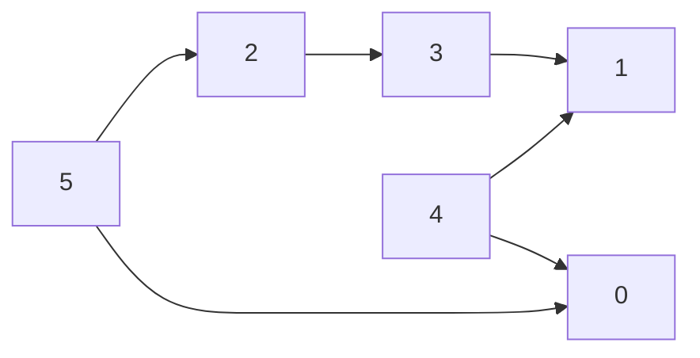

### Problem: Topological Sort Using BFS (Kahn's Algorithm)

---

### Short Revision Notes (Exam Quick Recall)

- Pattern: BFS on DAG using in-degree
- Core Idea: Nodes with in-degree 0 have no dependencies; process them first, reducing neighbors' in-degree
- Key Trick: If result size < V → cycle detected
- Complexity: O(V + E) time and space

---

### Code Snippet (Important Part Only)

```cpp
vector<int> indegree(V, 0);
for (int u = 0; u < V; u++)
    for (int v : adj[u]) indegree[v]++;

queue<int> q;
for (int i = 0; i < V; i++)
    if (indegree[i] == 0) q.push(i);

while (!q.empty()) {
    int u = q.front(); q.pop();
    order.push_back(u);
    for (int v : adj[u])
        if (--indegree[v] == 0) q.push(v);
}
// order.size() < V  →  cycle!
```

---

### Detailed Explanation

- **Step 1:** Compute in-degree for each vertex.
- **Step 2:** Add all 0-in-degree vertices to the queue.
- **Step 3:** BFS: dequeue a vertex, add to result, decrement in-degree of all its neighbors. If any hits 0, enqueue it.
- **Cycle detection:** A cycle means some nodes never reach in-degree 0 → they're never enqueued → result is incomplete.

**Why it works:** A node can be "processed" only after all its dependencies are done (in-degree reaches 0).

**Edge cases:**
- DAG with multiple valid topological orders
- Disconnected DAG
- Graph with a cycle (partial result)

**Common mistakes:**
- Applying to undirected graph (undefined for non-DAGs)
- Not checking result size for cycle detection

---

### Dry Run

Graph: 5→2, 5→0, 4→0, 4→1, 2→3, 3→1

In-degrees: 0=2, 1=2, 2=1, 3=1, 4=0, 5=0  
Queue start: [4, 5]  
Process 4: neighbors 0,1 → indegree[0]=1, indegree[1]=1  
Process 5: neighbors 2,0 → indegree[2]=0(enqueue), indegree[0]=0(enqueue)  
Process 2: neighbor 3 → indegree[3]=0(enqueue)  
Process 0: no neighbors  
Process 3: neighbor 1 → indegree[1]=0(enqueue)  
Process 1  

Result: `4 5 2 0 3 1`

---

### Visualization (USE MERMAID ONLY, NO ASCII)


