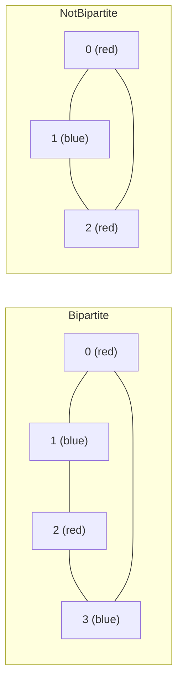

### Problem: Check if Graph is Bipartite Using BFS

---

### Short Revision Notes (Exam Quick Recall)

- Pattern: BFS 2-coloring
- Core Idea: Color a node, color all neighbors the opposite color; conflict → not bipartite
- Key Trick: A graph is bipartite iff it has no odd-length cycles
- Complexity: O(V + E) time, O(V) space

---

### Code Snippet (Important Part Only)

```cpp
color[src] = 0;
while (!q.empty()) {
    int u = q.front(); q.pop();
    for (int v : adj[u]) {
        if (color[v] == -1) {
            color[v] = 1 - color[u];  // opposite color
            q.push(v);
        } else if (color[v] == color[u]) {
            return false;  // same color = conflict = not bipartite
        }
    }
}
```

---

### Detailed Explanation

- Assign color 0 to source, BFS outward.
- Each neighbor gets the opposite color (0↔1).
- If a neighbor already has the same color as the current node → odd cycle → not bipartite.
- Repeat for all unvisited nodes (handles disconnected graphs).

**Why it works:** Bipartite = 2-colorable. BFS guarantees we check all edges for color conflicts.

**Edge cases:**
- Disconnected graph: must start BFS from every unvisited node
- Single node: trivially bipartite
- Tree: always bipartite (no cycles)

**Common mistakes:**
- Only starting BFS from node 0 (missing disconnected components)
- Not initializing color array to -1

---

### Dry Run

Graph: 0-1-2-3-0 (even cycle, bipartite)

| Node | Color |
|------|-------|
| 0    | 0     |
| 1    | 1     |
| 2    | 0     |
| 3    | 1     |

Edge 3-0: color[3]=1, color[0]=0 → no conflict ✓ → **Bipartite**

Graph: 0-1-2-0 (odd cycle, not bipartite)  
color[0]=0, color[1]=1, color[2]=0; edge 2-0: both color 0 → **Not Bipartite**

---

### Visualization (USE MERMAID ONLY, NO ASCII)


