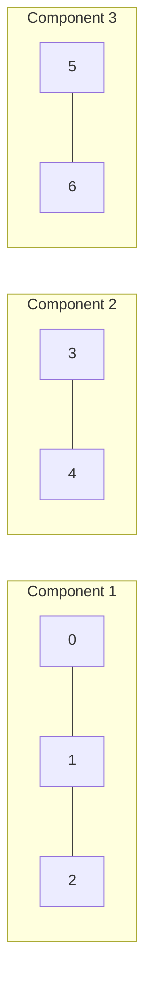

### Problem: Find Connected Components in Undirected Graph

---

### Short Revision Notes (Exam Quick Recall)

- Pattern: BFS/DFS with visited array
- Core Idea: For each unvisited node, do BFS — all reachable nodes form one component
- Key Trick: Count how many times you start a fresh BFS = number of components
- Complexity: O(V + E) time, O(V) space

---

### Code Snippet (Important Part Only)

```cpp
int count = 0;
for (int src = 0; src < V; src++) {
    if (visited[src]) continue;
    count++;  // new component found
    // BFS from src marks all nodes in this component
    bfs(src, visited, adj);
}
return count;
```

---

### Detailed Explanation

- Iterate over all vertices. When an unvisited vertex is found, increment the component counter and BFS/DFS to mark all reachable vertices as visited.
- The total number of BFS/DFS starts equals the number of connected components.

**Why it works:** BFS/DFS from a node visits exactly all nodes in its connected component. Starting a new BFS from an unvisited node means it's a different component.

**Edge cases:**
- All nodes connected: 1 component
- No edges: V components (each node is its own component)
- Single node: 1 component

**Common mistakes:**
- Forgetting to handle disconnected graphs (only running BFS from node 0)
- Using directed adjacency list for undirected graph (must add edges in both directions)

---

### Dry Run

7 nodes: edges 0-1, 1-2, 3-4, 5-6

Visit 0 → BFS reaches {0,1,2} → component 1  
Visit 3 → BFS reaches {3,4} → component 2  
Visit 5 → BFS reaches {5,6} → component 3  
Node 6: already visited  

Total: **3 components**

---

### Visualization (USE MERMAID ONLY, NO ASCII)


