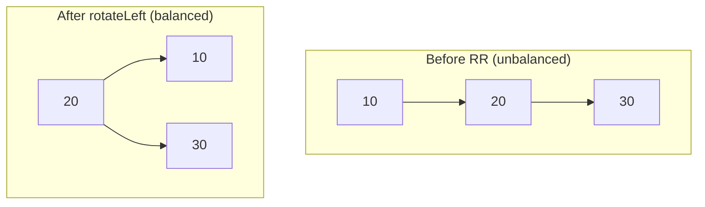

### Problem: AVL Tree (Self-Balancing BST)

---

### Short Revision Notes (Exam Quick Recall)

- Pattern: BST with balance factor maintenance
- Core Idea: After every insert, check balance factor (BF = left_height - right_height); if |BF| > 1, rotate
- Key Trick: 4 cases — LL, RR, LR (left then right rotate), RL (right then left rotate)
- Complexity: O(log n) insert/search, O(n) space

---

### Code Snippet (Important Part Only)

```cpp
int b = bf(root);  // balance factor

if (b > 1 && key < root->left->key)   return rotateRight(root);       // LL
if (b < -1 && key > root->right->key) return rotateLeft(root);        // RR
if (b > 1 && key > root->left->key) {                                  // LR
    root->left = rotateLeft(root->left);
    return rotateRight(root);
}
if (b < -1 && key < root->right->key) {                                // RL
    root->right = rotateRight(root->right);
    return rotateLeft(root);
}
```

---

### Detailed Explanation

- **LL (Left-Left):** New node in left subtree of left child → single right rotation.
- **RR (Right-Right):** New node in right subtree of right child → single left rotation.
- **LR (Left-Right):** New node in right subtree of left child → left rotate left child, then right rotate root.
- **RL (Right-Left):** New node in left subtree of right child → right rotate right child, then left rotate root.

After each rotation, update heights of affected nodes bottom-up.

**Edge cases:**
- Duplicate keys: ignored (standard BST behavior)
- Deletion requires similar balancing (not in insert-only impl)

**Common mistakes:**
- Not updating height after rotation
- Confusing LR and RL case conditions
- Not recursively updating heights up the tree

---

### Dry Run

Insert: 10, 20, 30 → RR case at 10 (balance factor = -2)

```
Insert 10: root=10 (h=1)
Insert 20: root=10 (h=2), right=20
Insert 30: bf(10)=-2, 30>20 → RR rotation
  rotateLeft(10): 20 becomes root, 10 is left child
Result: 20(root) → left:10, right:30
```

---

### Visualization (USE MERMAID ONLY, NO ASCII)


